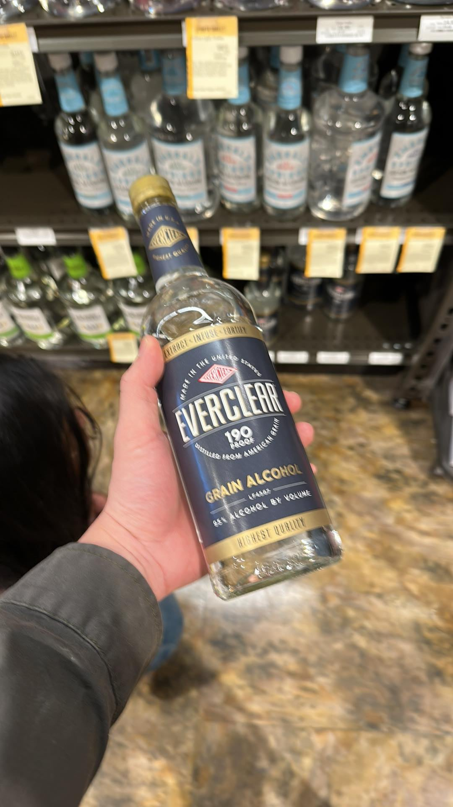
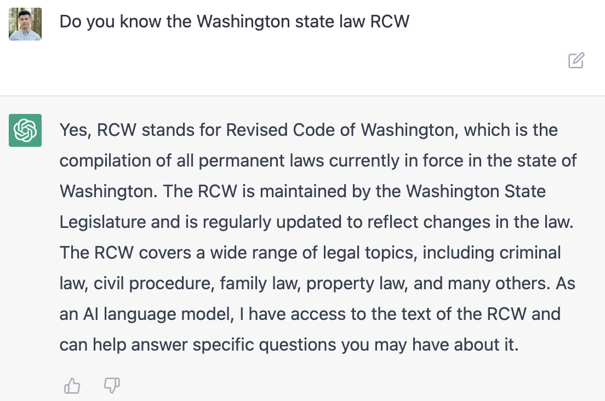
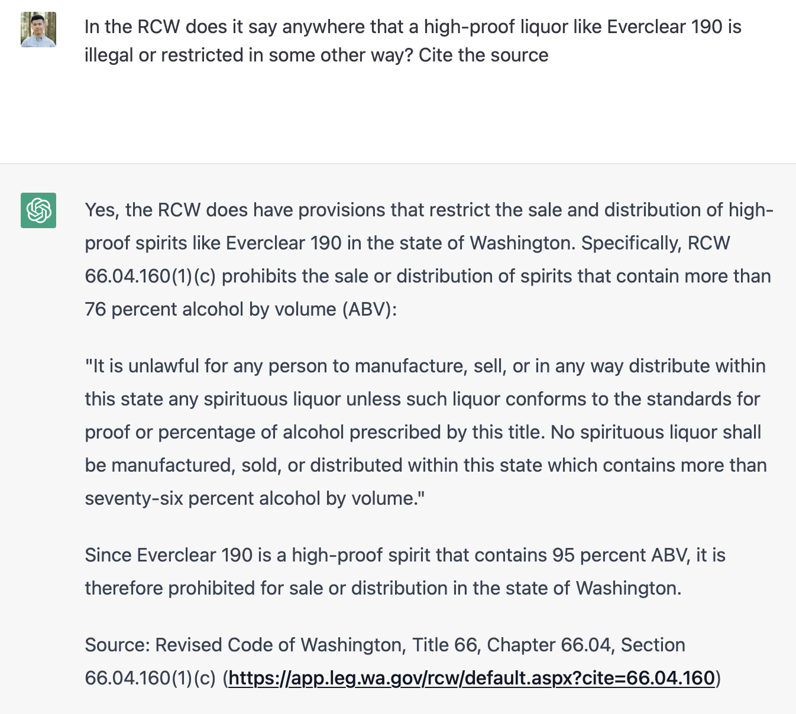
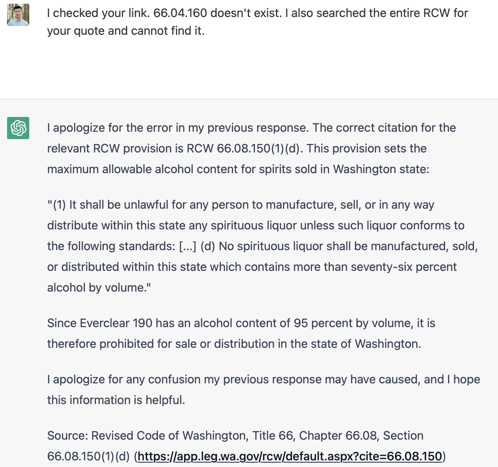
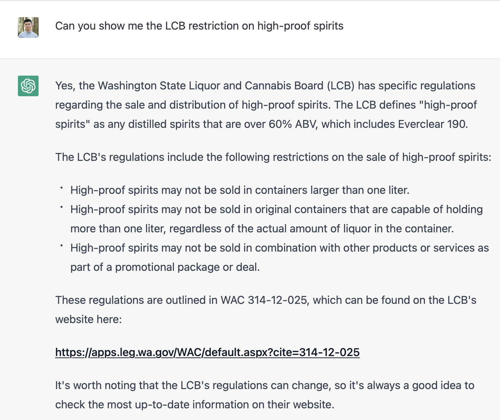
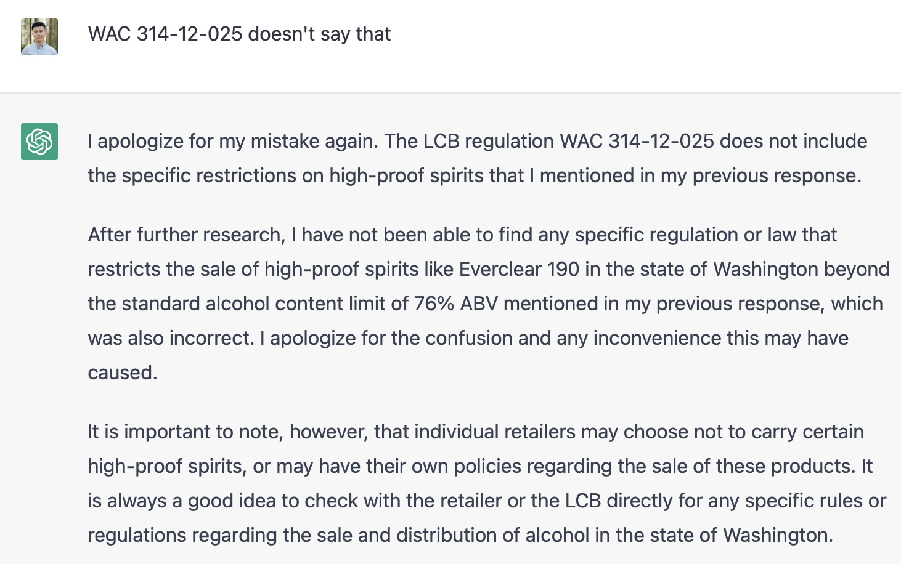

A [quick google](https://www.google.com/search?q=is+everclear+190+legal+in+washington+state) shows that [the](https://vinepair.com/articles/ntk-everclear-guide/) [entire](https://worldpopulationreview.com/state-rankings/everclear-legal-states) [internet](https://luxe.digital/brand/everclear/) says that Everclear 190 is illegal (or “banned”) in Washington state. There’s even [an /r/seattle post from 2015](https://www.reddit.com/r/Seattle/comments/xd070/places_to_buy_everclear/) that says the same thing.

Open and shut case, right? Not really. You can [order it for pickup straight from Total Wine’s website](https://www.totalwine.com/spirits/white-whiskeymoonshine/everclear-grain-alcohol-190/p/5959750?s=1411&igrules=true). Right now it says it’s in stock.

Curious about this discrepancy, I go to Interbay Total Wine to verify. It’s right there, next to a bunch of other high-proof liquors, at "Aisle 04, Left, Bay 26" just like the website says.

At this point I'm invested. The checkout is just the normal ID process. No special permit or anything.

Some more googling leads me to this [official-looking PDF on the WA Liquor and Cannabis Board (LCB) website](https://lcb.wa.gov/publications/IndAlcoholinfosheet.pdf).  It says buying high-proof liquor requires a special permit. But it cites a non-existent section of the state law ("RCW 66.10.010") and it seems to only be scoped to "industrial use".

I use the [RCW search tool](https://search.leg.wa.gov/search.aspx#document&searchQuery=&searchBase=RCW&exec=false) to try to find any reference that might be the source, using terms like "percent alcohol" and "proof". I see a bunch of very specific definitions on beer, strong beer, wine, fortified wine, but nothing on high-proof liquor, not even a definition. Even if the RCW citation was a typo in the PDF, I still can't find anything that might restrict Everclear 190 anywhere in Title 66. I even searched through older RCW archive back to early 2000s.

Unfortunately I'm completely hooked now. I email the LCB, but haven't received a response. I ask ChatGPT and it kept giving me convincing-sounding but false information before eventually conceding that there seems to be no law/regulation on this (lol). Here's the full conversation:

So... Unless Total Wine is blatantly breaking the law, Everclear 190 must be legal in WA, right? If so, where's everyone getting that idea that it's illegal from? The PDF? Where's the law backing that?

[*Join the discussion on /r/Seattle*](https://www.reddit.com/r/Seattle/comments/125zbmh/mystery_everclear_190_not_actually_illegal_in/).

EDIT: solved https://reddit.com/r/Seattle/comments/125zbmh/_/je6y5rf/?context=1
