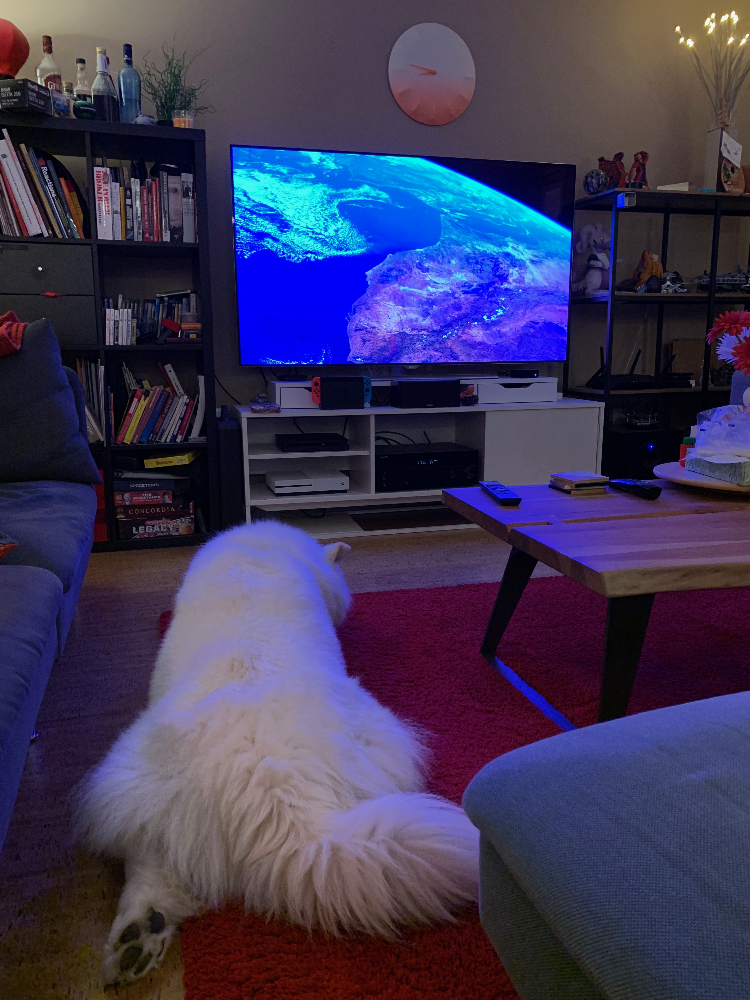
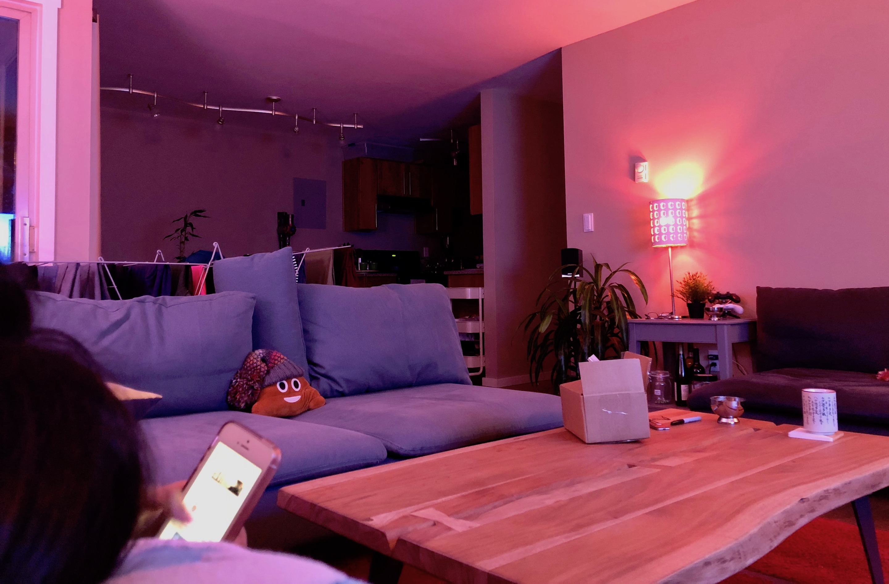
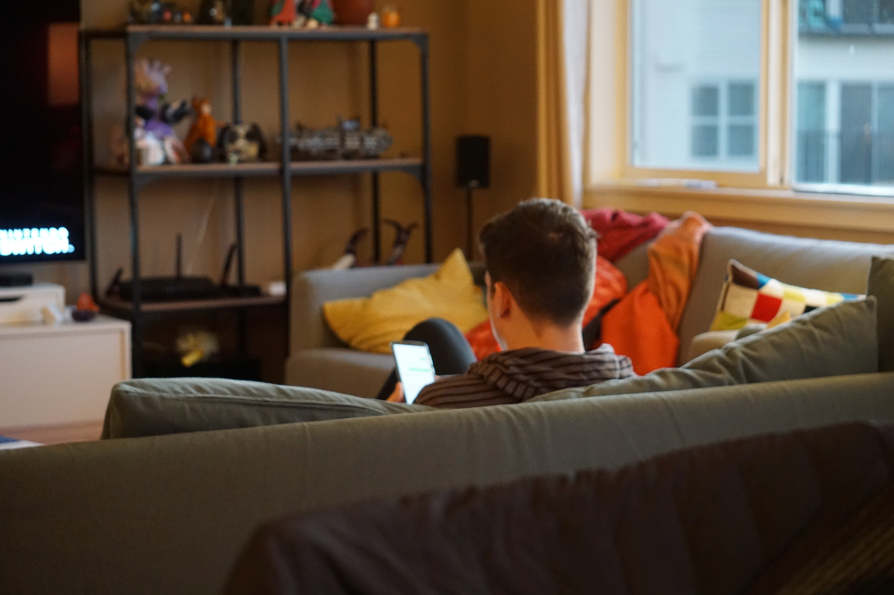

Since moving to Seattle I have been gradually automating an ordinary apartment. The goal is not to build a trade-show demo; it is to make the lights, TV, door, and vacuum respond consistently. Online discussions often highlight the worst connected gadgets, but with some patience (and a few hubs) the living room can anticipate daily routines instead of fighting them.

## Where we are and how we got here

The automation itch started in the laziest way possible: I was already under the blanket and wished the lamp would turn off by itself. That nudge toward [Philips Hue](https://www.philips-hue.com) led to [HomeKit](https://www.apple.com/ios/home/), which led to buying a [Raspberry Pi](https://www.raspberrypi.org) at 1 a.m. because I could not believe there was no native way to control the TV. Once one subsystem cooperated, every other annoyance turned into a candidate for automation. The snapshot below shows the apartment as it stands today.



## Lamps: the entry point

Hue bulbs are still the friendliest introduction to home automation. The starter kit (bridge, two color bulbs, a dimmer) took twenty minutes to install and immediately solved the bedtime problem. From there it turned into a lighting design exercise: warm white ramps in the morning, saturated color scenes for movie nights, and a full-bright scene that aligns every lamp when guests arrive.

- Hardware: Hue Bridge v2, six A19 color bulbs, one Lightstrip Plus, two Hue Dimmer remotes.
- Software: Home app automations for sunrise and sunset, Hue app for color scenes, HomeKit scenes for pairing with motion sensors later.



Hue's value is less in the rainbow gimmick and more in the automation primitives: every lamp reports state, exposes brightness, and can join a HomeKit scene.

## Getting the TV to behave

The TV is the opposite of plug-and-play. I want an [Apple TV](https://www.apple.com/apple-tv-4k/), an [LG](https://www.lg.com/us/tvs) display, and a first-generation [Logitech Harmony](https://www.logitech.com/products/harmony/universal-remotes/harmony-hub.915-000238.html) Hub to behave as a single unit when I get home. There is no native HomeKit path yet, so the answer is a Raspberry Pi 3 running Homebridge with the [`homebridge-harmony`](https://github.com/nicoduj/homebridge-harmony) and [`homebridge-webos`](https://github.com/merdok/homebridge-webos-tv) plugins.

```json
{
  "platforms": [
    {
      "platform": "HarmonyHub",
      "name": "Living Room",
      "hubIP": "192.168.1.40",
      "showTurnOffActivity": true
    },
    {
      "platform": "webostv",
      "name": "LG OLED",
      "ip": "192.168.1.55",
      "mac": "AA:BB:CC:DD:EE:FF"
    }
  ]
}
```

The Home app now has a scene called `Movie Time` that powers on the Apple TV, switches the receiver to the right input, and sets the Hue lights to 20% warm white. It mostly works, with two gotchas:

1. Harmony's idea of device state drifts if a roommate uses the physical remote. Unfortunately, there's no viable fix.
2. HomeKit treats the TV as stateless, so a deliberate button is required to turn everything off. A 1 a.m. automation checks whether the Apple TV is still playing, powers down everything, and returns the lights to normal.

I wrote up the Homebridge reliability hacks separately in [this post](); the short version is to keep `systemd` watchdogs on both `homebridge` and the Harmony daemon, or the facade crumbles the first time the Pi reboots.

## Door lock: no more keys

The [August Smart Lock](https://august.com/products/august-smart-lock-pro-connect) (3rd gen) replaced the deadbolt without touching the exterior hardware, which satisfied both security and landlord constraints. The promise is auto-unlock as you walk up the stairs while carrying groceries; the reality is 80% success, 20% digging for your phone.

- Installed with the August Connect Wi-Fi bridge to expose the lock to HomeKit and [Google Assistant](https://assistant.google.com/).
- Geo-fence auto-unlock is set to the small radius so the lock does not open when I walk past the building.
- HomeKit forces a confirmation prompt for location-based unlocks, so the workaround is letting the Arriving Home scene turn on a [dummy homebridge switch](https://github.com/mpatfield/homebridge-dummy) and having a HomeKit automation watch for that dummy switch turning on to run the unlock scene. See the guide [documented here](https://www.homekithelper.net/devices/locks#h.p_CW03erdJdNGw) and here.


# Building buzzer: Twilio callbox

Our building still uses a plain analog buzzer that expects someone to answer the phone and press `9`. To get rid of the scramble for keys, I wrote a small bundle of [Twilio Functions](https://www.twilio.com/functions) that live in the cloud and act as a smart doorman. The project lives at on GitHub:



Features include:

- Voice password using Twilio's speech recognition so friends can speak a passphrase at the callbox
- PIN code fallback
- Automatic escalation that dials everyone in the apartment if the passphrase or PIN are not provided[^prompt]
- SMS notifications that report whether someone used the code or needed a manual buzz-in.

[^prompt]: Since the prompt I set is "please wait", people whole are unaware of the system aren't weirded out and just wait for someone to pick up, like a normal buzzer.

The flow is lightweight:

1. The callbox forwards to a Twilio number that triggers `buzzer-activated.js`, which gathers either a passphrase or digits.
2. If the credentials match, `door-open.js` plays the DTMF `9` tone and sends me a "door opened" text through `text-me.js`.
3. If the caller ignores it, `call-residents.js` keeps dialing our phones until someone picks up and handles it the old-fashioned way.

Setup fits on a single checklist: buy a Twilio number, paste each script into the Functions console, add environment variables (`PASSPHRASE`, `PASSCODE`, `TWILIO_PHONE`, and the resident phone numbers), then point the apartment callbox at that number. My Twilio bill sits under $2/month—$1 for the number and pennies for speech recognition—so the experiment is cheap enough to leave running. Once it proves reliable, the last step is to expose the latch trigger to HomeKit so automations can let trusted visitors in.

## Wall switches: replacing the habit

Hue bulbs make lamps smart, but guests still reach for the wall switch out of habit. Enter the GOAT: [Lutron Caseta](https://www.casetawireless.com/) system. Seattle apartments built before 2000 rarely have neutral wires, so Caseta's no-neutral dimmers and Pico remotes were the only viable option.

- Hardware: Caseta Smart Bridge, three in-wall dimmers, two Pico remotes strapped to magnetic wall plates.
- Software: Lutron app schedules for overnight dimming, HomeKit exposure for consistency across rooms.

Installation took an afternoon and delivered two immediate benefits: physical switches now trigger scenes (not just on/off), and the living room lights participate in automations even when someone insists on using real buttons. Caseta also integrates with Google Assistant, which keeps guests happy.

Lastly and why Lutron Caseta is the GOA: the reliability. The system has worked flawlessly for six months with no dropped commands or phantom triggers. I'll never hesitate to recommend Caseta for anyone wanting to automate existing lighting.

## Voice control in practice

Typing on a phone to turn on a light is worse than walking to the switch. Voice control fixes that. A [HomePod](https://www.apple.com/homepod/) now anchors the living room because Siri understands my HomeKit rooms without extra naming and handles 90% of the scenes. A [Google Home Mini](https://store.google.com/product/google_home_mini) sticks around as the shared-space backup so roommates keep their own [Spotify](https://www.spotify.com/) accounts via multi-user profiles.

The two assistants coexist peacefully because Siri owns the deterministic HomeKit scenes end-to-end, while Google fills the few gaps where Assistant-only skills or multi-user profiles still matter. Plus, you can get them to talk to each other, which is hilarious.

## Vacuum: Xiaomi on cleaning duty

If you automate one chore, make it vacuuming. The [Xiaomi](https://www.mi.com/global/mi-robot-vacuum/) Mi Robt is the best value robot I have found and, with a little token extraction[^token], works with Homebridge via [`homebridge-xiaomi-roborock-vacuum`](https://github.com/homebridge-xiaomi-roborock-vacuum/homebridge-xiaomi-roborock-vacuum).

[^token]: The method changes all the time, check the homebridge plugin README for the latest.

- Nightly schedule: start at 2 a.m. on weekdays, skip weekends to avoid waking anyone.
- Manual trigger: Google Assistant phrase `start cleaning` hits the same Homebridge endpoint and runs a quick job.
- Maintenance: clean the bin every three runs, replace filters quarterly, check the brush for hair every Sunday.

The robot is the automation that gets the biggest reaction when friends visit. Pair it with the `goodnight` scene and it starts a short cleaning run as soon as the living room lights fade.

## Platform principles

Home automation can sprawl quickly if you do not set guardrails. I am sticking to these guardrails:

- HomeKit first: if it cannot appear in the Home app, it needs a bridge strategy on day one.
- One assistant per task: Siri handles personal scenes, Google Assistant handles shared spaces.
- Local control or nothing: cloud fallbacks are fine, but basic control must work during an internet outage.
- State visibility: every automation needs a way to know whether it already fired; blind timers are maintenance debt.

## Backlog and process

I manage the smart home like a software project: there is a [Trello](https://trello.com/) board with `Ideas`, `Experimenting`, `Live`, and `Rollback` columns. Each card lists the story ("make lights look occupied while traveling") plus hardware, software, cost, and a rollback plan. Sounds excessive, but it prevents midnight purchases that never ship.

Backlog highlights right now:

- Automate the dumb coffee maker with a smart outlet and tie it to the wake-up routine.
- Add motion sensors in the hallway to trigger night lights without waking the whole apartment.
- Replace mixed Hue and Caseta dimming with scene-based lighting that respects color temperature throughout the day.

## Future work

- Thermostat: the landlord-provided [Honeywell](https://www.honeywell.com/us/en) brick has no API. The [Ecobee](https://www.ecobee.com/en-us/smart-thermostats/) 3 Lite looks like the best HomeKit-friendly replacement.
- Blinds: south-facing windows turn the living room into a greenhouse. Considering Soma Smart Shades or a DIY stepper motor for the [IKEA](https://www.ikea.com/us/en/cat/roller-blinds-10655/) rollers.
- Automatic music: imagine [Sonos](https://www.sonos.com/) powering up with `Arrive Home`. Requires a speaker upgrade and some [Spotify Connect](https://www.spotify.com/us/connect/) scripting.
- Coffee: once the kettle and grinder join the party, morning automation graduates from novelty to necessity.



## What is working so far

Home automation is less about gadgets and more about enforcing good defaults. The best wins so far are subtle: lights that fade in before the alarm rings, a door that unlocks without a key hunt, and a TV stack that mostly behaves. The system is still fragile in places (Harmony most of all) but it is dependable enough that I only notice the friction when a hub crashes. Next step is to keep chipping away at the backlog, document the rough edges, and convince the building to modernize the buzzer sooner rather than later.
