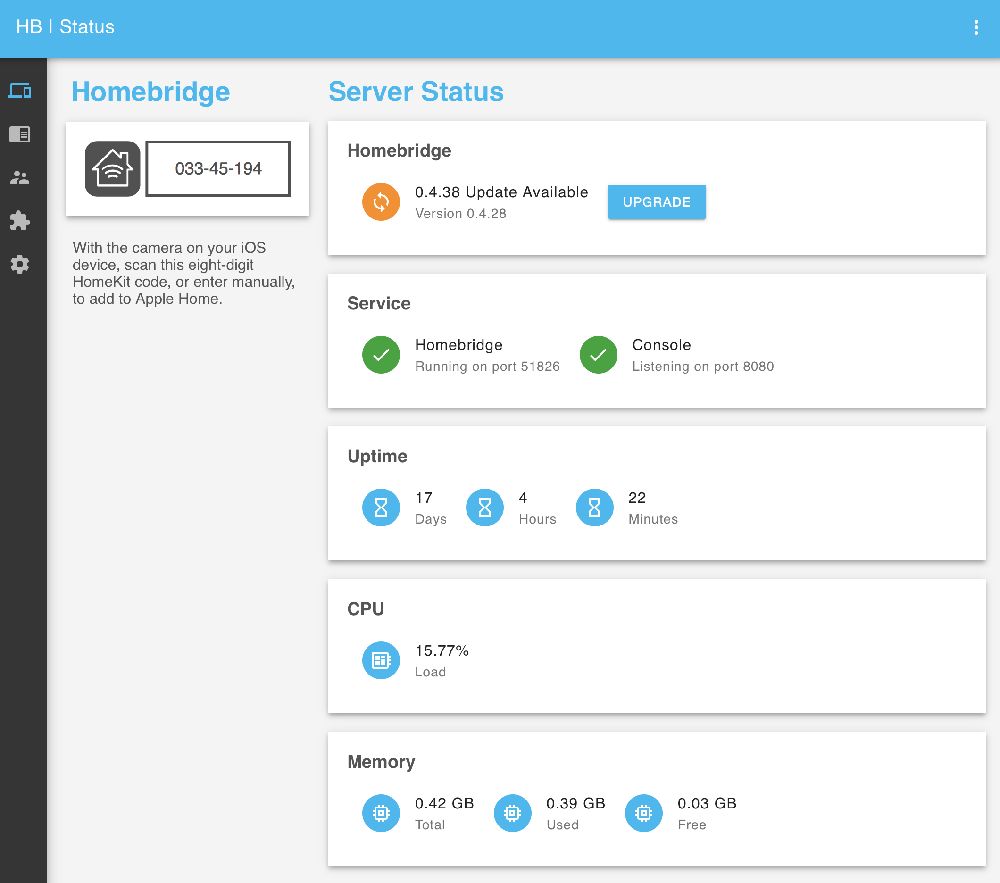

[Homebridge](https://github.com/nfarina/homebridge) is a key part to my home automation setup. I run it on a Raspberry Pi (gen 1, pictured in header) and it allows me to integrate my TV, Apple TV, and robot vacuum into HomeKit. However, it does crash quite a bit. Here are some things I did to make Homebridge easier to deal with.

<!--more-->

## Use systemmd to keep Homebridge always running

To get Homebridge to start automatically on boot and restart on crashes, check out [these instructions from Tim](https://timleland.com/setup-homebridge-to-start-on-bootup/). After you get `systemmd` set up, always go to `/var/homebridge` to edit your `config.json`.

To check the logs, I'd recommend:

```bash
sudo journalctl -fexu homebridge
```

From [here](https://serverfault.com/questions/738547/centos-7-systemctl-no-feedback-or-status-output).

## Set up a web interface to quickly check status

To set up a cool web interface for monitoring your homebridge status, check out [homebridge-config-ui](https://www.npmjs.com/package/homebridge-config-ui).



Since you're now using `systemmd` with it, add this to your config:

```json
{
    "platform": "config",
    "port": 8080,
    "log": "/var/log/daemon.log",
    "restart": "sudo systemctl restart homebridge"
}
```

The log view might take a while to show anything, but the config should be right.
