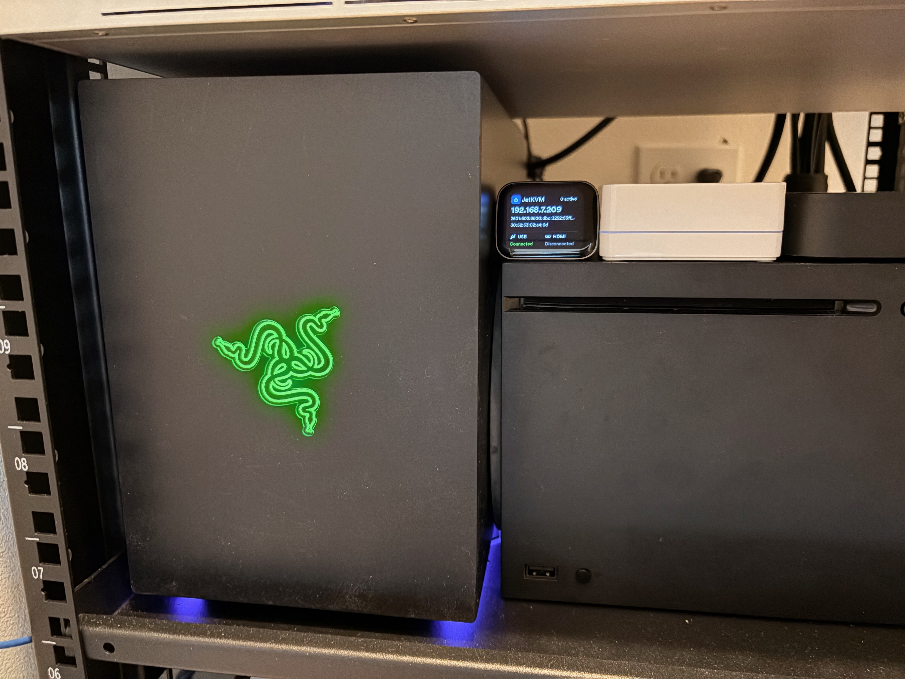
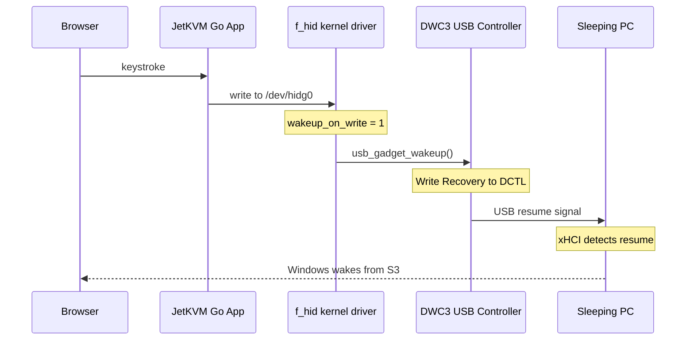

In 2022 I [patched the Raspberry Pi kernel](/posts/tinypilot-usb-wake/) so TinyPilot could wake my sleeping PC over USB. Since then, the setup changed. I wanted to upgrade my Raspberry Pi to a Pi 5 (16 GB of RAM!), but TinyPilot didn't support it. So I replaced TinyPilot with a [JetKVM](https://jetkvm.com/), a dedicated KVM-over-IP device that doesn't need a Raspberry Pi. The Pi 5 now runs other things.

JetKVM already had a Wake-on-LAN button, and I set up nginx in front of it for remote access and automated WoL[^nginx]. But when I bought it, it couldn't wake my PC over USB, the same way a real keyboard would. Other people had reported the same problem in [jetkvm/kvm#120](https://github.com/jetkvm/kvm/issues/120). Since I'd already dealt with this on the Pi, I figured I should try porting the fix.

[^nginx]: There's a little more to it. The JetKVM web UI binds to its local IP, so I put nginx on a Raspberry Pi with a domain and TLS cert to make it reachable remotely. Then I added `mirror /wake-trigger;` to the proxy `location /` block, which fires a WoL CGI script on every proxied request. Since the JetKVM UI makes dozens of requests on load (assets, API calls, WebSocket upgrade), opening the dashboard carpet-bombs the PC with wake packets. The PC is usually already booting by the time the page finishes loading. This is absolutely overkill. For full remote access including video, I use Tailscale, which works perfectly since WebRTC can traverse the tunnel.



## The setup

The PC in question is "Tomahawk," a Windows 11 desktop that lives in my [media closet](/posts/media-closet/) and sleeps after 30 minutes of inactivity. JetKVM connects via HDMI (through a DP-to-HDMI adapter) and USB-C, giving me a browser-based remote desktop. When the PC was awake, it worked great. When it slept, JetKVM showed "No HDMI signal detected" and every keystroke I sent disappeared.


A real USB keyboard could wake Tomahawk. I wanted JetKVM's emulated keyboard to do the same.

## Why it didn't work

The USB HID gadget driver (`f_hid`) in JetKVM's kernel didn't ask the USB controller to send a remote wakeup signal before writing HID reports. Sending a keystroke to `/dev/hidg0` wasn't enough: with the host asleep and the USB bus suspended, the controller first needed to signal the host to resume.

This was the same missing piece I'd hit with TinyPilot. The [HID patch](https://github.com/jetkvm/rv1106-system/pull/57/files) makes the driver call `usb_gadget_wakeup()` before each write when a configfs flag (`wakeup_on_write`) is set. But the USB controller underneath it was different.

## DWC3 vs DWC2

My TinyPilot ran on a Raspberry Pi 4, which uses the Synopsys **DWC2** USB controller. JetKVM runs on a Rockchip RV1106, which uses **DWC3**. That meant a different controller driver and a different wake implementation.

DWC3 already had a wake callback wired up. For TinyPilot, I had used [@mdevaev](https://github.com/mdevaev)'s PiKVM patch to fix the DWC2 wake helper as well as the HID driver ([my preserved copy](https://github.com/raspberrypi/linux/compare/rpi-5.15.y...jlian:linux:rpi-5.15.y)). On JetKVM, [`dwc3_gadget_wakeup`](https://github.com/jetkvm/rv1106-system/blob/release/v0.2.8/sysdrv/source/kernel/drivers/usb/dwc3/gadget.c#L2406-L2480) was already there. The HID write path just wasn't calling it.

JetKVM's 5.10.160 kernel didn't have the PiKVM `wakeup_on_write` addition, so I needed to port that part.

In my initial implementation, a browser keystroke would take this path to wake the host from S3 sleep[^s3]:

[^s3]: S3 is the sleep state used by this PC: memory stays powered while much of the rest of the system shuts down. It isn't the same as hibernation or Modern Standby. Microsoft documents the differences in [System power states](https://learn.microsoft.com/en-us/windows-hardware/drivers/kernel/system-power-states).



That required two changes:
1. **Kernel (`f_hid.c`)**: Add the `wakeup_on_write` configfs attribute, call `usb_gadget_wakeup()` in `f_hidg_write()` when it's set
2. **JetKVM Go app**: Set `bmAttributes = 0xa0` (advertise remote wakeup capability) and `wakeup_on_write = 1` on all three HID functions (keyboard, absolute mouse, relative mouse)

The patches were small. Getting them tested took an entire Saturday.

## Building and testing the patch

I started by re-reading my own blog post from 2022. Port the `wakeup_on_write` patch, set the configfs attributes, done. Seemed straightforward.

I cloned [`jetkvm/rv1106-system`](https://github.com/jetkvm/rv1106-system) on my build VM, ran `install.sh` to set up the ARM cross-compile toolchain, and wrote the patch. The f_hid changes were nearly identical to the PiKVM version. Build took about 8 minutes. I flashed the boot partition via SSH[^dd], rebooted JetKVM, deployed the updated Go app with `wakeup_on_write: "1"`, and ran the test:

[^dd]: I used `dd` over SSH to write directly to the boot partition (`/dev/mmcblk0p7`, the active B-slot). This is undocumented and I wouldn't recommend it for most people. The official way to flash firmware is through [DFU mode](https://jetkvm.com/docs/advanced-usage/factory-reset) using the SocToolKit. I used `dd` because I was iterating quickly and didn't want to enter DFU mode (which requires physically poking the reset pin) for every build.

```bash
echo -ne '\x00\x00\x2c\x00\x00\x00\x00\x00' > /dev/hidg0
```

Nothing happened. Tomahawk stayed asleep.

### The DWC3 polling loop

I dug into `dwc3_gadget_wakeup()`. After requesting Recovery, the driver polls for the USB link to return to U0 (active). The [loop in JetKVM's kernel](https://github.com/jetkvm/rv1106-system/blob/release/v0.2.8/sysdrv/source/kernel/drivers/usb/dwc3/gadget.c#L2449-L2464) looks like this:

```c
retries = 20000;
while (retries--) {
    reg = dwc3_readl(dwc->regs, DWC3_DSTS);
    if (DWC3_DSTS_USBLNKST(reg) == DWC3_LINK_STATE_U0)
        break;
}
```

If the link hasn't reached U0 by the end of those 20,000 reads, the function logs "failed to send remote wakeup" and returns `-EINVAL`. I saw that message and suspected the polling was the problem.

Newer upstream code had [made gadget wakeup asynchronous](https://github.com/torvalds/linux/commit/2372f1caeca433c4c01c2482f73fbe057f5168ce), specifically because polling could finish before the link became active. I tried removing the polling from my build: request Recovery through DCTL and return success.

Build #5 (both patches together): it works. Tomahawk wakes up. About 14 seconds from HID write to the host being reachable.


### Isolating the fix

I wanted a minimal PR, so I tested build #6 with only the f_hid patch and stock DWC3 code. It failed. Tomahawk stayed asleep. At that point I figured both patches were required.

But something didn't quite add up. The polling loop writes Recovery to DCTL *before* it starts polling. The resume signal is already on the wire by the time the loop begins. The poll just waits for the host to acknowledge. Why would removing the acknowledgment check be necessary for the signal to work?

I looked at the JetKVM's USB state more carefully:

```bash
cat /sys/kernel/config/usb_gadget/jetkvm/UDC_state
# not attached
```

The USB wasn't even connected. I had toggled the UDC for re-enumeration right before putting Tomahawk to sleep, and Windows entered S3 before USB finished re-enumerating. Build #6 didn't fail because of the DWC3 polling loop. It failed because there was no USB connection at all.

Build #8 (f_hid only, stock DWC3, clean USB state): works. 4.2 seconds.

That run was faster than build #5 with my DWC3 change (14.4s → 4.2s), though these tests don't establish why. What mattered was that the stock DWC3 driver could wake the host once I gave it an attached USB device.

I still got two "failed to send remote wakeup" messages in dmesg, but the PC woke anyway. In these tests, the error didn't mean no wake signal had been sent. I dropped the DWC3 change from the PR.[^devmem]

[^devmem]: There was another false lead earlier that day: writing directly to DWC3 registers with `devmem` appeared to wake the PC. But I'd written to `0xffb0c700`, not DCTL at `0xffb0c704`. The [register definitions](https://github.com/jetkvm/rv1106-system/blob/release/v0.2.8/sysdrv/source/kernel/drivers/usb/dwc3/core.h#L150-L156) identify the former as DCFG (device configuration). I don't know why that woke the host, and it wasn't a useful test of remote wakeup.

## Results

These measurements are from my original keyboard-triggered implementation, not the dedicated wake button JetKVM later shipped.

### Raw USB wake time (SSH to JetKVM, write to /dev/hidg0)

I measured from HID write completion to the first successful ping response from the host. Before each run, I put the PC to sleep and checked that it had stopped responding to pings.

| Run | Wake time |
|-----|-----------|
| 1   | 4,016ms   |
| 2   | 4,015ms   |
| 3   | 4,013ms   |
| **Avg** | **4,015ms** |

The PC was reachable again about four seconds after the write completed. This measures recovery to a ping response, not the duration of the USB wake signal itself.

[`powercfg /lastwake`](https://learn.microsoft.com/en-us/windows-hardware/design/device-experiences/powercfg-command-line-options#lastwake) reported the USB host controller each time:

```
Wake Source [0]:
  Type: Device
  Friendly Name: Intel(R) USB 3.1 eXtensible Host Controller
```

### End-to-end via JetKVM web UI

Measured from keypress in the browser to first video frame playing. I instrumented this with JS polling `video.currentTime` every 50ms, detecting when the WebRTC video stream advances from its frozen state.

| Run | Total time |
|-----|------------|
| 1   | 26.3s      |
| 2   | 26.2s      |
| 3   | 26.5s      |
| **Avg** | **26.3s** |

Video took about 22 seconds longer to return than a ping response. I suspect much of that was the GPU and HDMI output coming back on this machine (Intel Z390 + NVIDIA GPU), but these measurements don't separate that from JetKVM's capture and streaming startup.

## One caveat

In my tests, USB wake only worked if JetKVM had been enumerated by the host *before* it entered sleep. If JetKVM rebooted while the PC was already in S3, the USB device controller reported "not attached" and I couldn't wake it over USB. I still keep Wake-on-LAN available for that case.

## The PRs

I opened three PRs to make this work upstream:

1. **[jetkvm/rv1106-system#57](https://github.com/jetkvm/rv1106-system/pull/57)**: kernel f_hid `wakeup_on_write` patch — merged and shipped in [system 0.2.8](https://github.com/jetkvm/rv1106-system/releases/tag/release/v0.2.8)
2. **[jetkvm/kvm#1235](https://github.com/jetkvm/kvm/pull/1235)**: Go app `bmAttributes=0xa0` + `wakeup_on_write=1` — merged and shipped in [app 0.5.5](https://github.com/jetkvm/kvm/releases/tag/release/0.5.5)
3. **[jetkvm/kvm#1236](https://github.com/jetkvm/kvm/pull/1236)**: my "Try Wake Host" button for the no-signal overlay — **closed without merging**

The Go app change shipped first in app 0.5.5 on March 31, 2026. The kernel patch merged a few days later and reached production in system 0.2.8 on April 28. At that point USB wake worked out of the box, although there was not yet an obvious control for it in the web UI.

The JetKVM team added [end-to-end S3 suspend/wake tests](https://github.com/jetkvm/kvm/pull/1392) in app 0.5.6, then implemented [explicit USB wake control](https://github.com/jetkvm/kvm/pull/1471) for app 0.5.9. Their version adds a dedicated wake-only HID function and a **Try to wake** button to the no-signal overlay. Regular keyboard and mouse reports no longer wake a suspended host; only the explicit button does. That is cleaner than my proposed button, which would have sent a spacebar press through the normal keyboard device, and it avoids accidental wakes from stray browser input.

Thanks to [@mdevaev](https://github.com/mdevaev) for the original PiKVM patch, and to the [JetKVM team](https://github.com/jetkvm) for merging the kernel and app changes and adding the wake button. This time I don't have to keep running my own kernel build.
