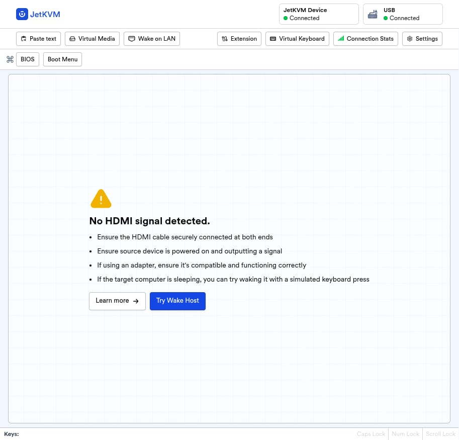
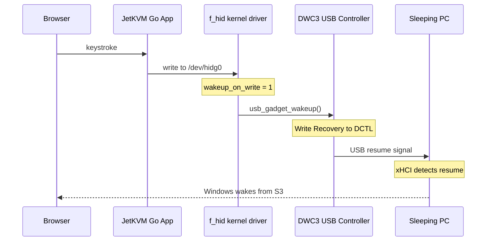
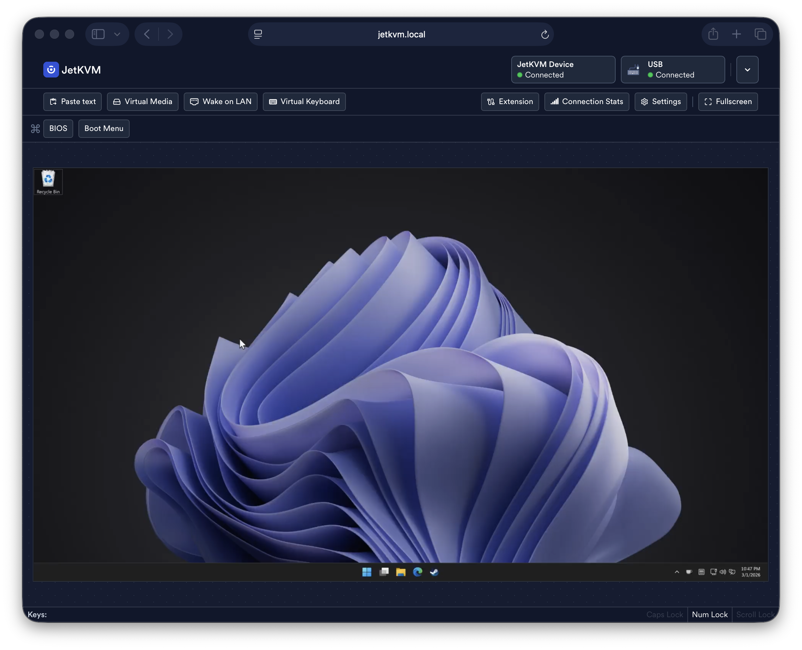

Three years ago I [patched the Raspberry Pi kernel](https://johnlian.net/posts/tinypilot-usb-wake/) so TinyPilot could wake my sleeping PC over USB. Since then, the setup changed. I wanted to upgrade my Raspberry Pi to a Pi 5 (16 GB of RAM!), but TinyPilot only supports the Pi 4. So I replaced it with a [JetKVM](https://jetkvm.com/): a dedicated KVM-over-IP device with its own hardware video capture, a web UI, and no Raspberry Pi dependency. The freed-up Pi 5 now runs other things.

JetKVM is a great device. It already has a Wake-on-LAN button built in, and I set up nginx in front of it for remote access and automated WoL[^nginx]. But the one thing it couldn't do was wake my PC over USB, the same way a real keyboard would. [Issue #120](https://github.com/jetkvm/kvm/issues/120) had been open for a while with community interest, and since I'd [already solved this exact problem](https://johnlian.net/posts/tinypilot-usb-wake/) on different hardware, I figured I should take a crack at it.

[^nginx]: There's a little more to it. The JetKVM web UI binds to its local IP, so I put nginx on a Raspberry Pi with a domain and TLS cert to make it reachable remotely. Then I added `mirror /wake-trigger;` to the proxy `location /` block, which fires a WoL CGI script on every proxied request. Since the JetKVM UI makes dozens of requests on load (assets, API calls, WebSocket upgrade), opening the dashboard carpet-bombs the PC with wake packets. The PC is usually already booting by the time the page finishes loading. This is absolutely overkill. For full remote access including video, I use Tailscale, which works perfectly since WebRTC can traverse the tunnel.

## The setup

The PC in question is "Tomahawk," a Windows 11 desktop that lives in a media closet and sleeps after 30 minutes of inactivity. JetKVM connects via HDMI (through a DP-to-HDMI adapter) and USB-C, giving me a browser-based remote desktop. When the PC is awake, it works great. When it sleeps, JetKVM shows "No HDMI signal detected" and every keystroke I send disappears.



A real USB keyboard wakes Tomahawk instantly. JetKVM pretends to be a USB keyboard. It should work. It doesn't.

## Why it doesn't work

Linux's USB HID gadget driver (`f_hid`) never asks the USB controller to send a remote wakeup signal before writing HID reports. When the host is asleep and the USB bus is suspended, writes to `/dev/hidg0` silently fail. The host's xHCI controller is ready to wake on a resume signal, but nobody sends one.

This is the same bug I hit with TinyPilot. The fix is the same concept: make the HID gadget call `usb_gadget_wakeup()` before each write when a configfs flag (`wakeup_on_write`) is set. But the details differ because JetKVM runs on entirely different hardware.

## DWC3 vs DWC2

TinyPilot runs on a Raspberry Pi 4, which uses the Synopsys **DWC2** USB controller. JetKVM runs on a Rockchip RV1106, which uses the Synopsys **DWC3**. Same company, different generation, different driver, different register layout, different wake mechanism.

The good news: DWC3 already has `gadget_wakeup` wired up. When I did this for TinyPilot, [@mdevaev](https://github.com/mdevaev) (the PiKVM creator) had to write `dwc2_hsotg_wakeup` from scratch and hook it into `usb_gadget_ops`. On JetKVM, `dwc3_gadget_wakeup` already exists, implemented and ready. It just never gets called from the HID write path.

The bad news: the `wakeup_on_write` patch that hooks into f_hid was never upstreamed to mainline Linux. JetKVM runs kernel 5.10.160, so I needed to port it.

Here's the full path a keystroke takes to wake the host:



Two changes needed:
1. **Kernel (`f_hid.c`)**: Add the `wakeup_on_write` configfs attribute, call `usb_gadget_wakeup()` in `f_hidg_write()` when it's set
2. **JetKVM Go app**: Set `bmAttributes = 0xa0` (advertise remote wakeup capability) and `wakeup_on_write = 1` on all three HID functions (keyboard, absolute mouse, relative mouse)

The kernel patch is 17 lines. The Go app change is 5 lines across 4 files. The debugging to get here took an entire Saturday.

## The debugging journey

### Getting started

I started by re-reading my own blog post from 2022. Port the `wakeup_on_write` patch, set the configfs attributes, done. Seemed straightforward.

I cloned `jetkvm/rv1106-system` on my build VM, ran `install.sh` to set up the ARM cross-compile toolchain, and wrote the patch. The f_hid changes were nearly identical to the PiKVM version. Build took about 8 minutes. I flashed the boot partition via SSH[^dd], rebooted JetKVM, deployed the updated Go app with `wakeup_on_write: "1"`, and ran the test:

[^dd]: I used `dd` over SSH to write directly to the boot partition (`/dev/mmcblk0p7`, the active B-slot). This is undocumented and I wouldn't recommend it for most people. The official way to flash firmware is through [DFU mode](https://jetkvm.com/docs/advanced-usage/factory-reset) using the SocToolKit. I used `dd` because I was iterating quickly and didn't want to enter DFU mode (which requires physically poking the reset pin) for every build.

```bash
echo -ne '\x00\x00\x2c\x00\x00\x00\x00\x00' > /dev/hidg0
```

Nothing happened. Tomahawk stayed asleep.

### The DWC3 polling loop

I dug into `dwc3_gadget_wakeup()` and found something interesting. The 5.10 kernel has a polling loop that waits for the USB link to transition to U0 (active) after sending the Recovery signal:

```c
for (retries = 20000; retries > 0; retries--) {
    reg = dwc3_readl(dwc->regs, DWC3_DSTS);
    if (DWC3_DSTS_USBLNKST(reg) == DWC3_LINK_STATE_U0)
        break;
    udelay(100);
}
```

That's 20,000 iterations of `udelay(100)`, about two seconds of busy-waiting in a spinlock. It's polling for a state transition that can't happen until the host finishes resuming from S3, which takes several seconds. The function times out, returns -ETIMEDOUT, and the HID gadget sees "failed to send remote wakeup."

Upstream Linux 6.x removed this loop entirely (the commit message calls it "racy and not needed for newer versions"). The JetKVM's DWC3 is v3.30a, well above the 1.94a threshold where the polling was needed. I patched it out: just write Recovery to DCTL and return success.

Build #5 (both patches together): it works. Tomahawk wakes up. About 14 seconds from HID write to the host being reachable.



### Isolating the fix

I wanted a minimal PR, so I tested build #6 with only the f_hid patch and stock DWC3 code. It failed. Tomahawk stayed asleep. At that point I figured both patches were required.

But something didn't quite add up. The polling loop writes Recovery to DCTL *before* it starts polling. The resume signal is already on the wire by the time the loop begins. The poll just waits for the host to acknowledge. Why would removing the acknowledgment check be necessary for the signal to work?

I looked at the JetKVM's USB state more carefully:

```bash
cat /sys/kernel/config/usb_gadget/jetkvm/UDC_state
# not attached
```

The USB wasn't even connected. I had toggled the UDC for re-enumeration right before putting Tomahawk to sleep, and Windows entered S3 before USB finished re-enumerating. Build #6 didn't fail because of the DWC3 polling loop. It failed because there was no USB connection at all.

Build #8 (f_hid only, stock DWC3, clean USB state): works. 4.2 seconds.

It was actually *faster* than build #5 with the DWC3 fix (14.4s → 4.2s). The stock polling loop holds the DCTL register in Recovery state for about 2 seconds while it spins, which gives the host xHCI controller a sustained resume signal. My "fix" wrote Recovery and immediately moved on. The sustained signal appears to be more reliable.

The two "failed to send remote wakeup" messages in dmesg are cosmetic (Recovery was already sent before the loop starts). The DWC3 change got dropped from the PR.

### The devmem detour

Earlier in the day, before any kernel patches, I tried waking Tomahawk by poking DWC3 registers directly via `devmem`. The DCTL register (device control) is at `0xffb0c704`. I wanted to write Recovery (value 8) into bits [8:5].

It appeared to work. Then I realized I'd been writing to `0xffb0c700`, which is DALEPENA (active endpoint enable), not DCTL. The two registers are 4 bytes apart. Writing an unexpected value to DALEPENA probably caused a USB bus fault that the host xHCI interpreted as a wake event. Not proper remote wakeup, just an accidental electrical glitch. Amusing in hindsight, confusing at the time.

## Results

### Raw USB wake time (SSH to JetKVM, write to /dev/hidg0)

Measured from HID write completion to first successful ping response from the host. Each test started from confirmed cold sleep (100% ping packet loss verified before sending the wake signal).

| Run | Wake time |
|-----|-----------|
| 1   | 4,016ms   |
| 2   | 4,015ms   |
| 3   | 4,013ms   |
| **Avg** | **4,015ms** |

Very consistent. The ~4 seconds is the PC's S3 resume time, not USB signaling latency.

`powercfg /lastwake` confirms the wake source every time:

```
Wake Source [0]:
  Type: Device
  Friendly Name: Intel(R) USB 3.1 eXtensible Host Controller
```

### End-to-end via JetKVM web UI

Measured from keypress in the browser to first video frame playing. I instrumented this with JS polling `video.currentTime` every 50ms, detecting when the WebRTC video stream advances from its frozen state.

| Run | Total time |
|-----|------------|
| 1   | 26.3s      |
| 2   | 26.2s      |
| 3   | 26.5s      |
| **Avg** | **26.3s** |

The ~22 second gap between "PC is network-reachable" and "video is playing in the browser" is mostly Windows GPU resume time: the GPU powers up from D3, reinitializes the display driver, and starts outputting HDMI again. That takes about 20 seconds on this machine (Intel Z390 + NVIDIA GPU) and is entirely outside JetKVM's control. The remaining ~2 seconds is JetKVM's capture pipeline restarting and WebRTC renegotiating.

## The PRs

Three PRs to make this work upstream:

1. **[jetkvm/rv1106-system#57](https://github.com/jetkvm/rv1106-system/pull/57)**: kernel f_hid `wakeup_on_write` patch (2 files, 17 lines)
2. **[jetkvm/kvm#1235](https://github.com/jetkvm/kvm/pull/1235)**: Go app `bmAttributes=0xa0` + `wakeup_on_write=1` (4 files, 5 lines)
3. **[jetkvm/kvm#1236](https://github.com/jetkvm/kvm/pull/1236)** (draft): "Try Wake Host" button in the no-signal overlay

The kernel patch needs to land first. Without it, the Go app changes advertise remote wakeup capability but can't deliver on it. The UI button depends on both.

## One caveat

USB wake only works if JetKVM was enumerated by the host *before* it entered sleep. If JetKVM reboots while the PC is already in S3, the USB device controller reports "not attached" and wake writes fail. You can't wake a host that never knew you existed. For that scenario, Wake-on-LAN (which JetKVM supports natively) is still the right tool.

## Wrapping up

Same bug, different hardware, same 17-line patch to `f_hid.c`. The PiKVM project's `wakeup_on_write` addition to the HID gadget driver is something that really should be in mainline Linux. Every USB gadget KVM hits this: TinyPilot, PiKVM, JetKVM, NanoKVM. Until it's upstreamed, we'll keep porting it to each new device.

Thanks to [@mdevaev](https://github.com/mdevaev) for the original patch that started all of this, and to the JetKVM team for building a device good enough that I wanted to fix the one thing it couldn't do.
