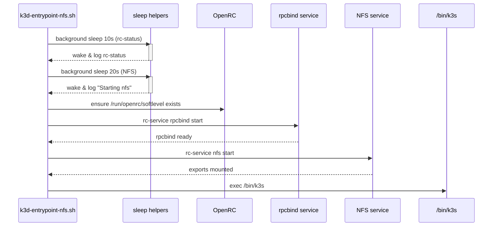
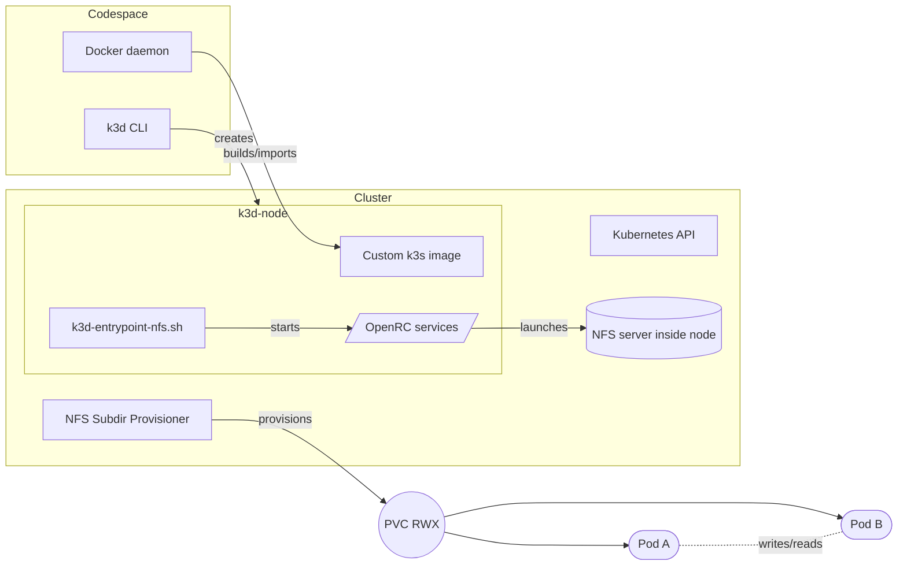

I need to use NFS with Kubernetes in GitHub codespaces for reasons. k3d[^k3d] already handled my throwaway clusters nicely, so the obvious move was to add an NFS-backed[^nfs] `ReadWriteMany` volume via [`nfs-subdir-external-provisioner`](https://github.com/kubernetes-sigs/nfs-subdir-external-provisioner). I expected it to “just work.”

It did not. Pods sat in `ContainerCreating` until they timed out with `mount.nfs: Operation not permitted`, the same failure called out in [k3d issue #1109](https://github.com/k3d-io/k3d/issues/1109). The root cause is boring but important: the stock k3s image ships from `scratch`[^scratch], so it contains none of the NFS client tools (`nfs-utils`, `rpcbind`[^rpcbind], or even the OpenRC[^openrc] metadata needed to start services). GitHub Codespaces run on cgroup v2[^cgroupv2], and k3d tries to be helpful in that environment by swapping in its own entrypoint script, which meant every hand-rolled fix I wrote was silently discarded. 

This post explains each speed bump and how it became this repo:



## Trying someone else's fix

The GitHub issue links to [marcoaraujojunior's Dockerfile](https://github.com/marcodearaujo/k3s-docker/commit/914c6f84e0b086ba86b15806062771d9fae5c274) through a commit mention.


On paper it solved everything: start from Alpine (a small Linux distro), install the NFS client tools, copy the official k3s binaries on top, and run a short entrypoint script that turns on the NFS service before handing control to k3s. There was no registry image at the time, so the flow looked like this:

```bash
docker build -t k3s-nfs:trial .
k3d image import k3s-nfs:trial -c test
k3d cluster create test \
  -i k3s-nfs:trial
```

The cluster booted, but `kubectl describe pod` still showed `Not supported` while mounting. Inside the node container, `rpcinfo -p` and `rc-service nfs status` both reported “service not running.” The tools were installed, but the init system (OpenRC) never ran its startup sequence because the container lacked the usual bookkeeping files. Copying someone else’s Dockerfile got me 80% of the way there, but the missing 20% was still the part that actually starts NFS.

## Teaching OpenRC to behave

OpenRC (the init system Alpine uses) checks `/run/openrc/softlevel`[^softlevel] to decide whether “boot already happened.” I found that clue after tailing `/var/log/rc.log` inside the container and noticing OpenRC yelling about “softlevel unset,” so the service would immediately exit. The k3s image never creates the file, so `rc-service nfs start` fails quietly and nothing mounts. The simplest fix is to create the directory and the file yourself before trying to start anything because that file is literally the “current runlevel” marker.

```dockerfile
RUN mkdir -p /run/openrc \
    && touch /run/openrc/softlevel
```

That tiny change plus explicit `rc-update add rpcbind`/`rc-update add nfs` finally let `rc-service nfs start` succeed. I kept Alpine as the base image so I could install `nfs-utils`/`rpcbind` for the client bits, `iptables`/`ip6tables` so kube-proxy can still program filter/NAT rules, and `openrc` itself to coordinate the services. After that I copied the k3s binaries straight from the official image. The full Dockerfile is in the repo, but the important bits look like this:

```dockerfile
FROM alpine:3.15
RUN apk add --no-cache iptables ip6tables nfs-utils rpcbind openrc
RUN rc-update add rpcbind && rc-update add nfs
RUN mkdir -p /run/openrc && touch /run/openrc/softlevel
COPY --from=rancher/k3s:v1.29.1-k3s1 /bin /bin
COPY k3d-entrypoint-nfs.sh /bin/
ENTRYPOINT ["/bin/k3d-entrypoint-nfs.sh"]
CMD ["agent"]
```

`k3d-entrypoint-nfs.sh` is deliberately boring: wait a few seconds (Codespaces are noisy during boot), make sure `/run/openrc/softlevel` exists, start NFS, then hand control to `/bin/k3s`. With that in place, `rc-status` finally reports that `nfs` and `rpcbind` are running before Kubernetes touches any volumes.



## When k3d helpfully replaces your entrypoint

Here’s the part that kept me up: k3d detects cgroup v2 hosts (Codespaces, most modern Docker installs) and swaps in its own entrypoint to apply kernel fixes. That is a good default, but it also overwrites whatever entrypoint you added, so my NFS startup script never ran. You can brute-force your way through by setting `export K3D_FIX_CGROUPV2=false` before `k3d cluster create`, which tells k3d “please keep your hands off my entrypoint.” That was my first workaround.

That diagnosis took longer than I care to admit because the custom entrypoint logs land under `/var/log/k3d/` inside the node rather than in `docker logs`, so every attempt looked like a silent success. I also learned the hard way that k3d v4 and older simply don’t support custom entrypoints for server nodes, so this trick only works on newer releases.

After I [shared](https://github.com/k3d-io/k3d/issues/1109#issuecomment-1613922061) my workaround with the issue thread, [iwilltry42](https://github.com/iwilltry42) [pointed out](https://github.com/k3d-io/k3d/issues/1109#issuecomment-1614415733) that k3d runs every script that matches `/bin/k3d-entrypoint-*.sh`. Dropping my script into that path means I can keep k3d’s default entrypoint *and* run my custom logic. Modern k3d releases include that hook, so disabling `K3D_FIX_CGROUPV2` is only needed for older versions.

## Putting it together

Once everything worked locally, I pushed the image to [GitHub Container Registry (GHCR)](https://github.com/jlian/k3d-nfs/pkgs/container/k3d-nfs) so future clusters could skip the `docker build`/`k3d image import` dance. With the published image available, the full workflow inside a Codespace (or any Docker host) is only a few commands:

```bash
# Optional: inspect the published images
docker pull ghcr.io/jlian/k3d-nfs:v1.29.1-k3s1

# Create the cluster with the image
k3d cluster create nfs \
  -i ghcr.io/jlian/k3d-nfs:v1.29.1-k3s1

# Install the provisioner like normal
helm repo add nfs-subdir-external-provisioner \
  https://kubernetes-sigs.github.io/nfs-subdir-external-provisioner/
helm install nfs nfs-subdir-external-provisioner/nfs-subdir-external-provisioner \
  --set nfs.server=host.k3d.internal \
  --set nfs.path=/
```

`docker pull` just caches the image locally so cluster creation is faster. `k3d cluster create` spins up the control-plane node and worker containers using the NFS-capable image. The last two commands install the upstream Helm chart that creates and manages the NFS server inside the cluster.

If you're running an older k3d release that predates the `/bin/k3d-entrypoint-*.sh` hook, set `K3D_FIX_CGROUPV2=false` before `k3d cluster create` so the custom entrypoint gets a chance to run.

Once the cluster is up, new pods stop complaining about `Not supported`, PersistentVolumeClaims bind as `ReadWriteMany`, and I can keep iterating without leaving the Codespace. The repo README lists the exact environment I tested along with the Docker and kernel versions in case you need to compare notes. Here’s that setup at a glance:



## Loose ends

There are still things I want to revisit. The image currently copies k3s binaries straight into `/bin`, which matches what `rancher/k3s` does but makes me nervous about Alpine updates. I'd also like to script the Codespaces bootstrap so older clusters automatically decide whether they need `K3D_FIX_CGROUPV2=false`. Even with those rough edges, touching `/run/openrc/softlevel` plus the `k3d-entrypoint-*.sh` hook has held up ever since that night, and now I can spin up RWX storage anywhere `k3d` runs.

[^k3d]: k3d wraps [k3s](https://k3s.io/) inside Docker containers so you can spin up a tiny Kubernetes cluster without managing VMs.
[^nfs]: NFS (Network File System) is the simplest way to share a POSIX-style folder across many clients.
[^scratch]: `scratch` is Docker’s “empty” base image—no package manager, shell, or utilities beyond what you copy in.
[^rpcbind]: `rpcbind` is the helper that lets NFS advertise itself to clients; without it, the kernel refuses to mount anything.
[^openrc]: OpenRC is Alpine’s init system—the bit that keeps track of which services should start and in what order.
[^cgroupv2]: cgroup v2 is the newer Linux resource-isolation scheme that changes how Kubernetes needs to configure the container runtime.
[^softlevel]: `/run/openrc/softlevel` records the current OpenRC runlevel; if it’s missing, OpenRC assumes the system never booted and refuses to launch services.
