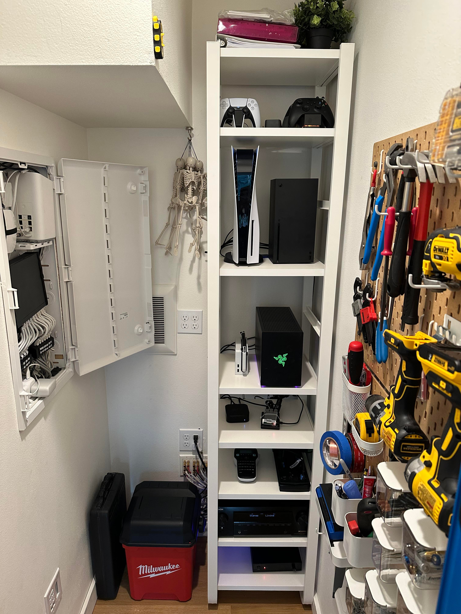
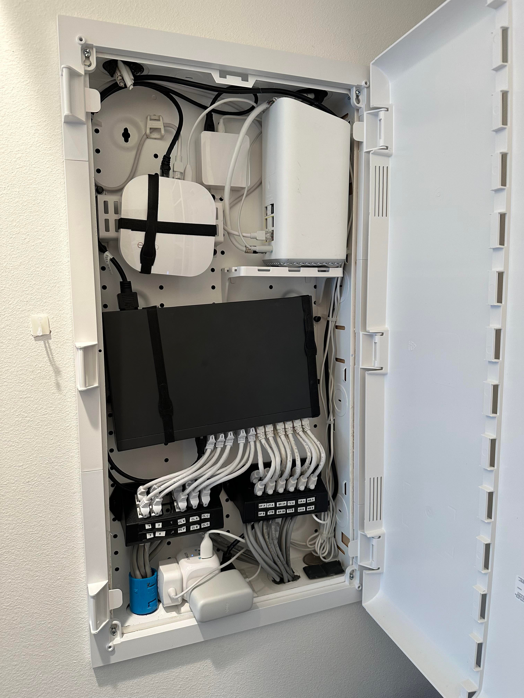
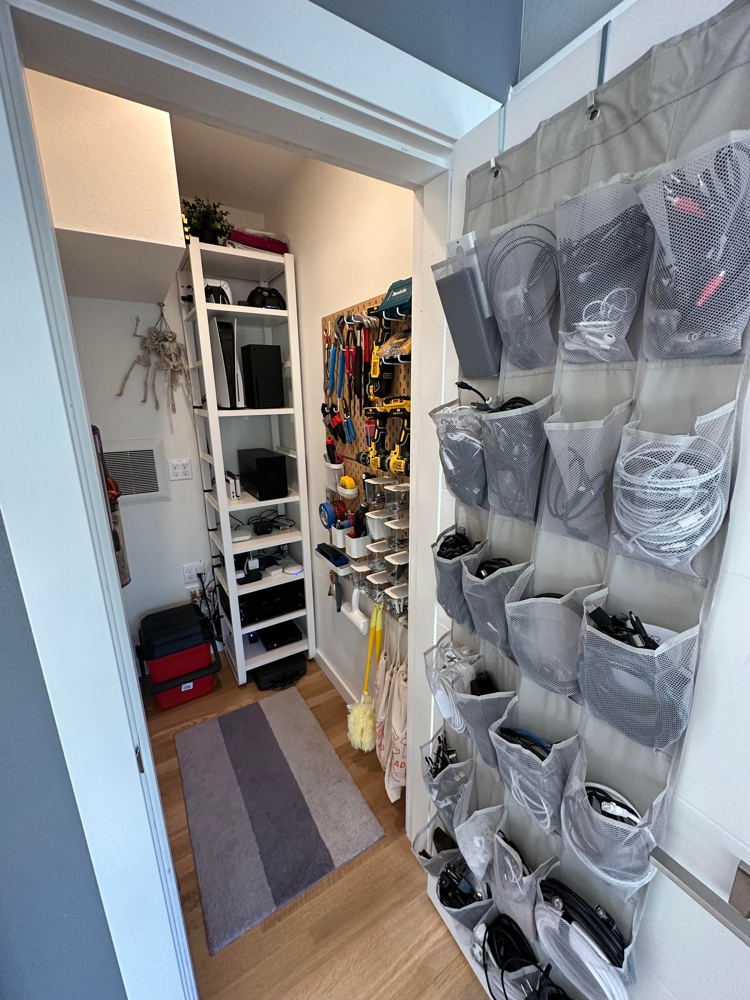
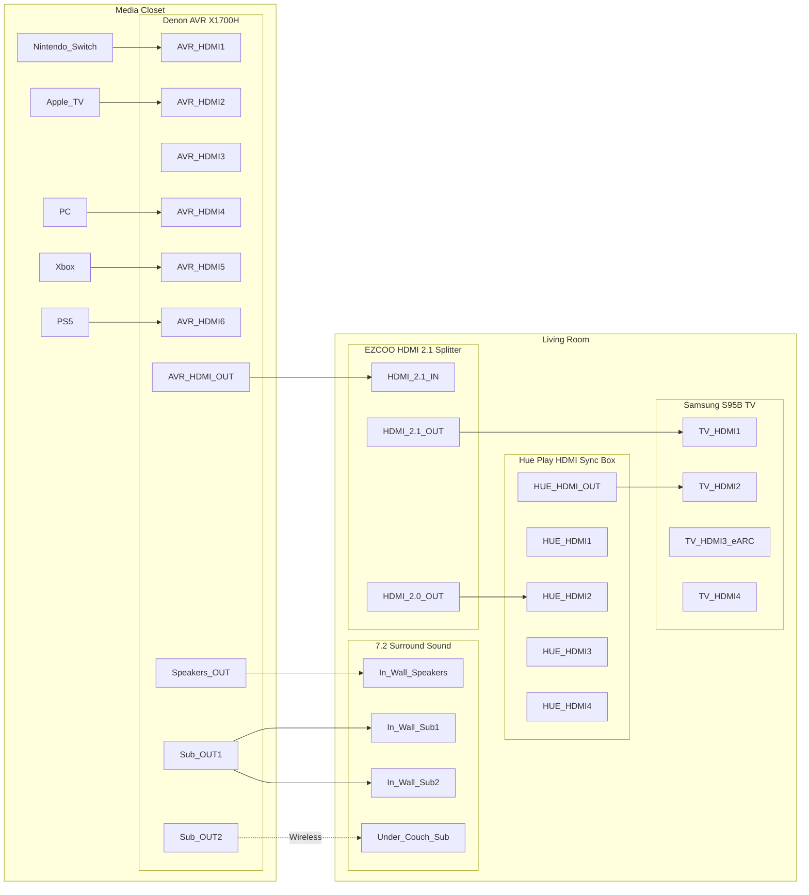
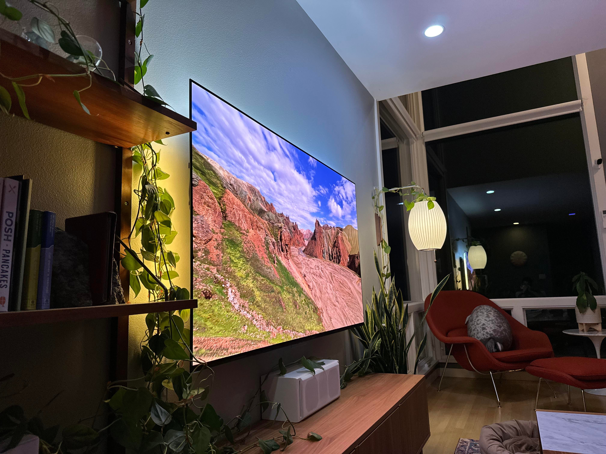
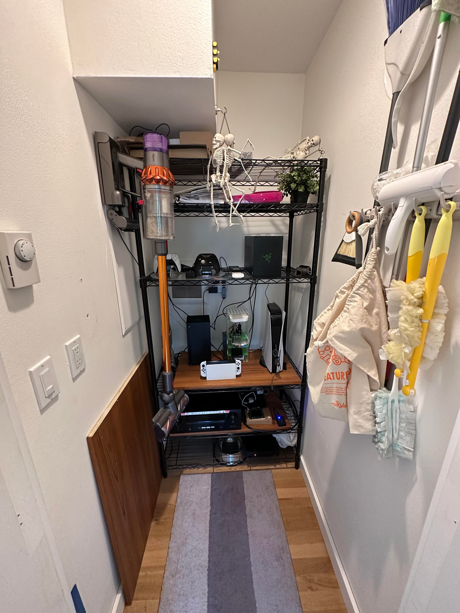

One closet to house all our networking and media equipment. Most of the hard work was done by the previous owner with the CAT6, HDMI, and speaker wires all in wall.

Here’s the network panel close up. I'm not super stoked about putting my eero gateway in here to act as the router but currently not sure what to upgrade to. Suggestions welcome.

View of tools peg board (IKEA) and spare cable storage (shoe organizer from Amazon).

Living room (behind the TV). A bunch of stuff here for Philips Hue backlight syncing + HDMI 2.1 compatibility.

Detailed diagram of the wiring:

Can't see the wires when the TV is mounted:

Bonus: before the cleanup:

[*Join the discussion on /r/HomeNetworking*](https://www.reddit.com/r/HomeNetworking/comments/zwvia0/cleaned_up_the_networkmedia_closet/).
