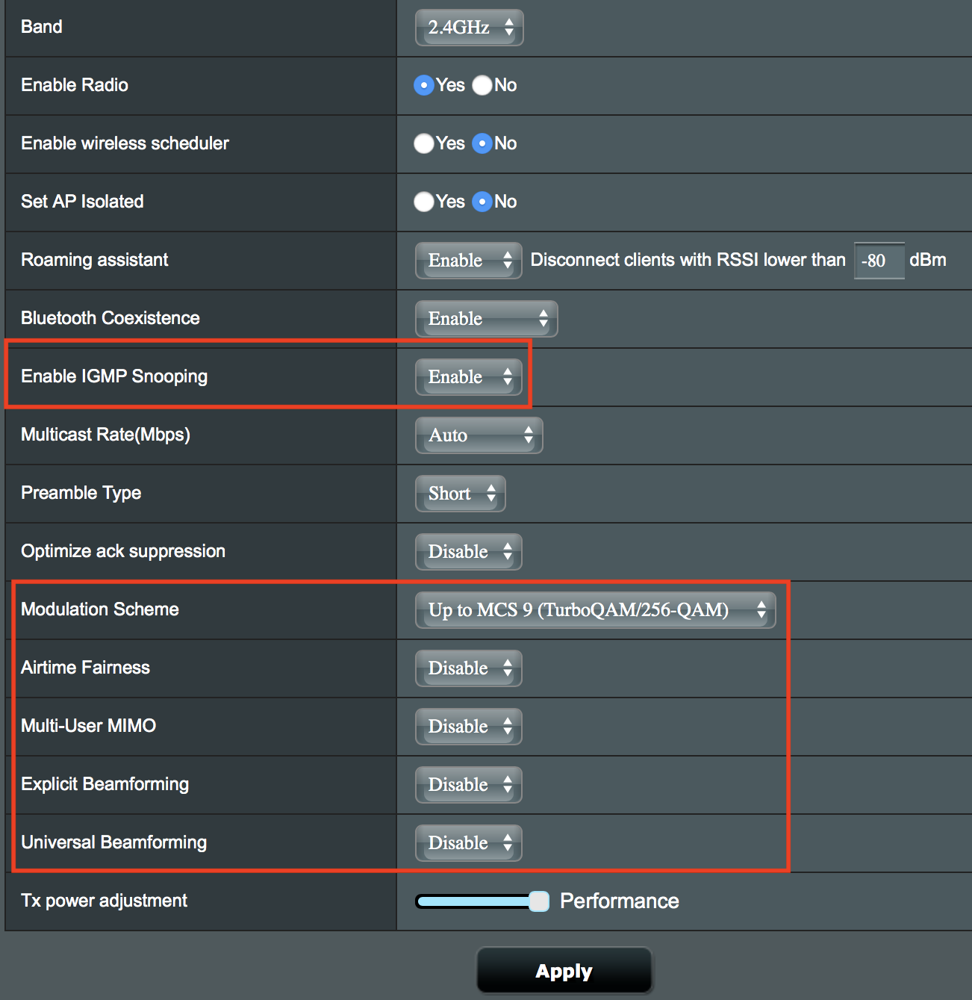
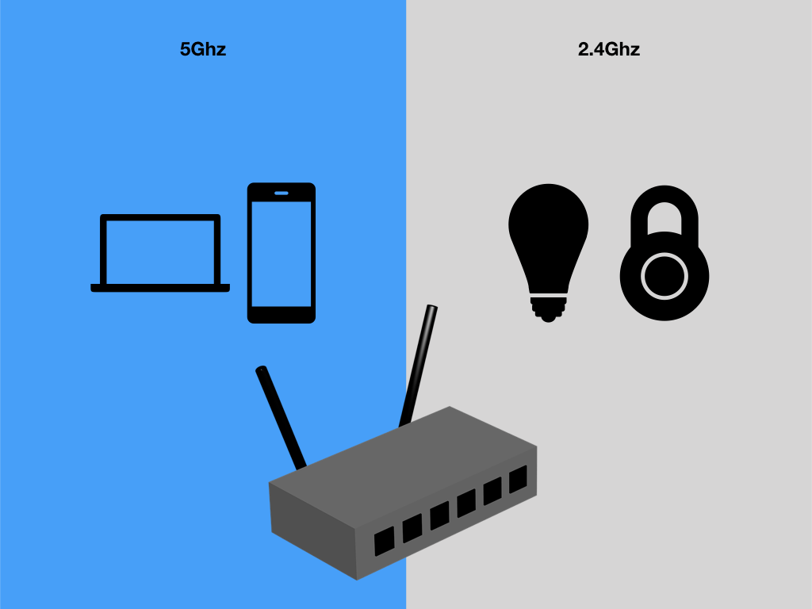

*Update June 2021: people felt the methods in this post are [too extreme](https://www.reddit.com/r/HomeKit/comments/b72vii/how_i_completely_fixed_not_responding/). Fortunately, ASUS has since published [a new support article on this topic](https://www.asus.com/support/FAQ/1042475/), and I've heard that it works better. I haven't tried it myself since I changed to eero (which works perfect with HomeKit) more than a year ago. Original post below.*

I've had pretty good experiences with HomeKit with Philips Hue and Lutron Caseta. However, I noticed that standalone devices (ones that don't have hubs) would often show "No Response" in HomeKit. This post shows some things that I learned trying to get all my devices to be reliable.

<!--more-->

## Disable your router's "advanced features"

For me, the root cause of the issue was that my router ([ASUS RT-AC88U](http://a.co/16d0YZQ)) was restricting proper communication between the two (2.4GHz and 5GHz) wifi bands. [This post](http://www.seriouslytrivial.com/2017/11/17/asus-rt-ac88u-wifi-and-airprint-wireless-printer-problem-solution/) led me to the eventual solution:

1. Login to the router's config page at http://router.asus.com/

1. Select **Wireless** on the left

1. Select **General**

1. Set *Control Channel* to **something other than Auto** for both **Bands**. [Learn how to set wifi channels](https://iihelp.iinet.net.au/Improving_WiFi_Signal_and_Changing_Channels)

1. Go to  **Professional**

1. Make these changes:
    - Enable IGMP Snooping: **Enable**
    - Multicast Rate(Mbps): **Auto**
    - Modulation Scheme: **Up to MCS 9 (802.11ac)**
    - Airtime Fairness: **Disable**
    - Multi-User MIMO: **Disable**
    - Explicit Beamforming: **Disable**
    - Universal Beamforming: **Disable**

    Then hit **Apply**

1. Change the **Band** to **5GHz**, then repeat Step 4, since each band's settings are independent from another. Leave *802.11ac Beamforming* as **Enabled**.

1. Go to **LAN** on the left, then select **IPTV**

1. Under *Special Applications*, make these changes:
    - Enable multicast routing (IGMP Proxy): **Enable**
    - Enable efficient multicast forwarding (IGMP Snooping): **Enable**

### Optional: set static IP addresses for your HomeKit devices

I don't have any evidence or sources but I believe having static IP addresses for your devices improves their network reliability, and make them easier to work with homebridge. For ASUS RT-AC88U:

1. Go to **Network Map**, under *Clients*, select **View List**

1. Select your device on the right, then turn *MAC and IP address Binding* to **On**

Even though I just disabled most of the advanced features of my router, I didn't see any performance changes (I haven't done the experiment, but I think leaving *802.11ac Beamforming* on helps). The above instructions apply only to my router, but you should explore doing the same for your router if you're seeing reliability problems with your HomeKit devices.

## Why the problem is almost certainly with your router

*But, but - my router is [almost $300](http://a.co/16d0YZQ)!!* That's what I said too. It turns out that there are a few factors that make it hard for HomeKit to be reliable on every wifi setup.

### To get good wifi in an apartment building you have to use 5GHz

Today, the 2.4GHz band in most populated areas are almost unusable. There're too many competing routers for the 12 bands available[^1]. If your router is newer it's probably dual-band, and your device is probably then also smart enough to figure out to use the 5GHz band because it's less congested. Your wifi probably isn't terrible all the time.

[^1]: What ends up happening is that since most routers are set to `channel = auto` they end up hopping from channel to channel, trying to get the lowest interference. But since everybody hops this way it becomes a game of musical chairs. The result is you're using a phone and suddenly your internet is slow. Your neighbor's router just decided to hop in your channel. Sup.

### HomeKit devices are all 2.4GHz, and your phone isn't

I haven't found any hub-less HomeKit devices that don't use 2.4GHz band for wifi[^2]. It makes sense since 2.4GHz [has better range and penetration than 5GHz](https://physics.stackexchange.com/questions/135033/why-do-2-4gHz-frequencies-offer-greater-range-than-5GHz-routers). Because 5GHz is higher energy, it attenuates more and has shorter range. The same physics that frees you from your neighbor's wifi interference helps your 2.4GHz devices communicate over longer distances.

[^2]: See [exhibit 1](https://www.koogeek.com/p-p1.html) from Koogeek, [exhibit 2](http://a.co/cvCLoSz) from iDevices, and [exhibit 3](http://support.august.com/customer/en/portal/articles/2167876-setting-up-august-connect?b_id=10919&) from August.

However, this does mean that your phone and laptop (5GHz) are going to be on different bands than your HomeKit devices (2.4GHz) as many modern routers support dual-band wifi.

### Bonjour services can sometimes work poorly across bands

The real revelation for me came from [this reddit post](https://www.reddit.com/r/HomeKit/comments/7x58n1/device_crashing_from_5GHz_wifi/du5qo12/). Essentially, routers can sometimes do wonky stuff when dealing with Bonjour/mDNS (this is what your phone uses to find HomeKit devices in your network) services across the 2.4GHz and 5GHz bands. Armed with this knowledge I eventually found that this is a fairly obscure issue that has been plaguing people for years, especially when it came to wireless printing (AirPrint). [This post](http://cyberelk.net/tim/2014/02/11/dual-band-routers-vs-mdns/) really drove home the concept for me. Basically, **if you can't see your HomeKit devices using [this app](https://itunes.apple.com/us/app/discovery-dns-sd-browser/id305441017?mt=8), then your router is probably doing something to block Bonjour/mDNS traffic between the 5GHz and 2.4GHz bands**.

### Look up your router's model + "mDNS" or "Bonjour"

Unfortunately since each router is so different, all I can offer is "look it up". However, I've been plagued by the "No Response" error for months and made no progress because I was going down the wrong path (troubleshooting devices instead of router), so I hope this post help you look the right way. Some more resources I found useful:

- [Bonjour/mDNS concepts talk](https://forum.opnsense.org/index.php?topic=3368.0)
- [*Using Bonjour Across Subnets* from above thread](https://kb.acronis.com/sites/default/files/content/2013/01/39490/wanbonjour_1.pdf)
- [Apple support forum thread on AirPrint for dual-band wifi](https://discussions.apple.com/thread/7139057)
- [Someone who also discovered that their router was causing "Not Responding"](https://github.com/nfarina/homebridge/issues/862)
