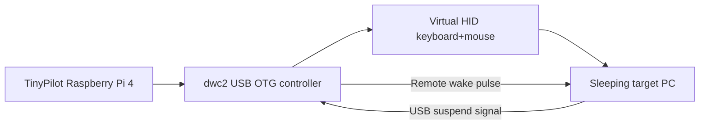
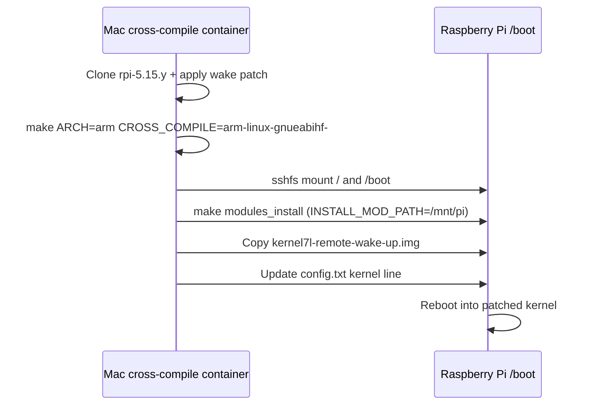

I rely on [TinyPilot](https://tinypilotkvm.com/) to manage a Windows PC that lives in a closet. TinyPilot is a Raspberry Pi-based KVM: it streams HDMI video from the PC and pretends to be a USB keyboard and mouse so I can type over the network. My PC also sleeps aggressively to save power. A real keyboard wakes it. TinyPilot did not, so every remote session began with a trip to the closet. Wake-on-LAN was unreliable on that motherboard, so I decided to make TinyPilot behave like a normal USB keyboard during suspend.

## TL;DR

In case you happen to be struggling with the same hyper-specific issue, here’s the quick guide:

1. Apply my fork of the dwc2 remote-wake patch to the Raspberry Pi `rpi-5.15.y` tree: [`raspberrypi/linux...jlian:linux:rpi-5.15.y`](https://github.com/raspberrypi/linux/compare/rpi-5.15.y...jlian:linux:rpi-5.15.y). Credit goes to [@mdevaev](https://github.com/mdevaev), the creator of PiKVM, for the original patch; I mirrored it so the link does not disappear again.
2. Build and install the patched kernel using the cross-compilation notes in [`jlian/linux-kernel-cross-compile`](https://github.com/jlian/linux-kernel-cross-compile). Those notes adapt [rockavoldy’s Mac M1 walkthrough](https://akhmad.id/compile-linux-kernel-on-mac-m1/) and add my extra steps for copying the result straight onto a Pi over SSHFS.
3. Update TinyPilot’s USB gadget setup script so both HID functions set `wakeup_on_write=1` and the USB configuration descriptor advertises remote wake: [diff](https://github.com/tiny-pilot/ansible-role-tinypilot/compare/master...jlian:ansible-role-tinypilot:master).
4. Reboot TinyPilot. Now any keystroke from the TinyPilot web UI (or a manual wake test) should bring the PC back. The quick test command is:

```bash
echo -ne "\0\0\x1a\x0b\x04\x17\x18\x13" > /dev/hidg0
```

## How TinyPilot, dwc2, and USB OTG fit together

TinyPilot uses the Raspberry Pi 4’s USB Type-C port in [**USB OTG** (On-The-Go)](https://en.wikipedia.org/wiki/USB_On-The-Go) mode. OTG lets a Pi act as either a USB host (plug in a thumb drive) or as a USB *device* (pretend to be a keyboard). The Linux driver that controls this port is called **dwc2**, short for DesignWare USB 2.0. When dwc2 is in “device” mode it can raise a **remote wake** signal so a sleeping host knows to resume.



- **TinyPilot Raspberry Pi 4** – runs Debian + TinyPilot software and exposes `/dev/hidg0` (keyboard) and `/dev/hidg1` (mouse).
- **dwc2 USB OTG controller** – a Synopsys USB block inside the Pi. In OTG “device” mode it behaves like a USB peripheral, not a host.
- **Virtual HID keyboard+mouse** – defined through Linux’s USB gadget framework.
- **Sleeping target PC** – expects a USB device to assert remote wake if it has permission.

A kernel change in Raspberry Pi OS 5.15 broke the wake behavior. When the PC sleeps, it signals over the USB bus that everything can enter a low-power state. For TinyPilot to wake it, dwc2 must briefly assert the `DCTL_RMTWKUPSIG` bit, and the HID gadget must request that wake-up at the right time. Both pieces were missing.

## Chasing clues

I first learned this was a real bug—not just me misconfiguring something—through [TinyPilot issue #829](https://github.com/tiny-pilot/tinypilot/issues/829). Other folks reported that their sleeping PCs ignored TinyPilot keystrokes unless Wake-on-LAN was enabled. Michael (TinyPilot’s creator) confirmed there wasn’t a software toggle to fix it. That sent me digging through kernel threads.

The only useful breadcrumb I found was a [Japanese blog post](http://www.dt8.jp/cgi-bin/adiary/adiary.cgi/0583) describing manual edits to `dwc2_hsotg_wakeup`. I mentioned it in [Raspberry Pi issue #3977](https://github.com/raspberrypi/linux/issues/3977#issuecomment-1200306484) hoping someone could translate the idea into a real patch. That’s where the story took a good turn.

## Fixing dwc2 so the Pi can raise remote wake again

Shortly after I dropped that comment, [mdevaev](https://github.com/mdevaev) (Maxim Devaev, creator of PiKVM[^pikvm]) [replied](https://github.com/raspberrypi/linux/issues/3977#issuecomment-1200368214) with a proper patch. PiKVM hit the same regression when Raspberry Pi OS moved to kernel 5.15. Maxim rewrote the wake helper so it works with the new clock-gating code, then exposed it via the gadget operations. The original link to the patch is 404, but here's the mirror in my fork:  [`raspberrypi/linux...jlian:linux:rpi-5.15.y`](https://github.com/raspberrypi/linux/compare/rpi-5.15.y...jlian:linux:rpi-5.15.y)

[^pikvm]: https://pikvm.org/, a popular Raspberry Pi-based KVM solution similar to TinyPilot that I would love to use except it requires Arch Linux, and I use Debian-based official image for Homebridge. 

The most important part is below.

```diff
+static int dwc2_hsotg_wakeup(struct usb_gadget *gadget)
+{
+    struct dwc2_hsotg *hsotg = to_hsotg(gadget);
+    ...
+    if (hsotg->params.power_down == DWC2_POWER_DOWN_PARAM_NONE && hsotg->bus_suspended) {
+        /* exit clock gating so the PHY can toggle remote wake */
+        pcgctl = dwc2_readl(hsotg, PCGCTL);
+        pcgctl &= ~PCGCTL_GATEHCLK;
+        dwc2_writel(hsotg, pcgctl, PCGCTL);
+        udelay(5);
+        ...
+    }
+
+    dwc2_set_bit(hsotg, DCTL, DCTL_RMTWKUPSIG);
+    mdelay(10);
+    dwc2_clear_bit(hsotg, DCTL, DCTL_RMTWKUPSIG);
+    ...
+}
+
+static const struct usb_gadget_ops dwc2_hsotg_gadget_ops = {
+    ...
+    .wakeup = dwc2_hsotg_wakeup,
+};
```

Here, the new `dwc2_hsotg_wakeup` helper brings the controller out of its low-power clock-gated state, raises the `DCTL_RMTWKUPSIG` pulse long enough for the host to notice, and then hands control back to the gadget stack. Wiring that helper into `usb_gadget_ops.wakeup` means any HID gadget that sets `wakeup_on_write=1` now triggers the remote wake sequence before sending keystrokes, restoring the behavior that stock USB keyboards provide.

The patch also adds a `wakeup_on_write` knob to the HID gadget driver. Without it, the kernel never asks dwc2 to wake the host before writing to `/dev/hidg0`. With the code fix in hand, the next step was the step that I was most nervous about: compiling and installing a custom Linux kernel.

## Building my first Raspberry Pi Linux kernel

Until this project I had never compiled the Linux kernel. I ended up spending a weekend piecing together a workflow that runs entirely on my Mac but installs directly onto the Raspberry Pi sitting in the closet. I found [Akhmad's guide](https://akhmad.id/compile-linux-kernel-on-mac-m1/) and [Jeff Geerling’s docker setup](https://github.com/geerlingguy/raspberry-pi-pcie-devices/tree/master/extras/cross-compile) and adapted them fit my setup. I documented the full process on GitHub:



Here's a condensed version in one place:

```bash
# Start Dockerized cross-compile container (runs arm-linux-gnueabihf toolchain)
git clone https://github.com/jlian/linux-kernel-cross-compile.git
cd linux-kernel-cross-compile
docker-compose up -d
docker attach cross-compile

# Grab Raspberry Pi Linux kernel sources (shallow) and apply the wake patch
git clone --depth 1 --branch rpi-5.15.y https://github.com/raspberrypi/linux
cd linux
patch -p1 -i ../1003-remote-wakeup.patch   # or check out my compare branch directly

# Configure for a 32-bit Pi 4 TinyPilot image
export KERNEL=kernel7l
make ARCH=arm CROSS_COMPILE=arm-linux-gnueabihf- bcm2711_defconfig

# Build kernel + modules + device tree blobs (takes ~10 minutes on an M2 Air)
make -j8 ARCH=arm CROSS_COMPILE=arm-linux-gnueabihf- zImage modules dtbs

# Mount the Pi’s partitions over SSHFS so installs land directly on the device
ssh-keygen -t ed25519 -C "build-container"
ssh root@homebridge.local mkdir -p /root/.ssh   # enable root SSH temporarily
ssh root@homebridge.local 'cat >> /root/.ssh/authorized_keys' < ~/.ssh/id_ed25519.pub
mkdir -p /mnt/pi-ext4 /mnt/pi-fat32
sshfs root@homebridge.local:/ /mnt/pi-ext4
sshfs root@homebridge.local:/boot /mnt/pi-fat32

# Install modules and copy the kernel/artifacts
make ARCH=arm CROSS_COMPILE=arm-linux-gnueabihf- INSTALL_MOD_PATH=/mnt/pi-ext4 modules_install
cp arch/arm/boot/zImage /mnt/pi-fat32/kernel7l-remote-wake-up.img
cp arch/arm/boot/dts/*.dtb /mnt/pi-fat32/
cp arch/arm/boot/dts/overlays/*.dtb* /mnt/pi-fat32/overlays/
cp arch/arm/boot/dts/overlays/README /mnt/pi-fat32/overlays/

# Point config.txt at the new kernel, then unmount
printf 'kernel=kernel7l-remote-wake-up.img\n' | sudo tee -a /mnt/pi-fat32/config.txt
umount /mnt/pi-ext4 /mnt/pi-fat32
# (optional) disable root SSH once the copy is done
```

A diagram of the full process mostly to help me remember it later:




Surprisingly the build worked the first time. After rebooting TinyPilot into the new kernel, I confirmed the dwc2 version:

```bash
dmesg | grep dwc2
[    1.234567] dwc2 3f980000.usb: DWC2 USB OTG Controller
[    1.234890] dwc2 3f980000.usb: new USB bus registered, assigned bus number 1
[    1.235123] dwc2 3f980000.usb: DWC2 Host Driver
[    1.235456] dwc2 3f980000.usb: dwc2_hsotg_wakeup function present
```

## Discovering `wakeup_on_write` the hard way

After the patched kernel booted, I was convinced the problem was solved. Then I tried the wake test again and still got:

```bash
pi@homebridge:~ $ echo -ne "\0\0\x1a\x0b\x04\x17\x18\x13" > /dev/hidg0 &&   echo -ne "\0\0\0\0\0\0\0\0" > /dev/hidg0
-bash: echo: write error: Resource temporarily unavailable
```

At that point I went back to the Raspberry Pi issue thread and [updated my comment](https://github.com/raspberrypi/linux/issues/3977#issuecomment-1204729258), assuming I had messed up the build. Maxim [replied](https://github.com/raspberrypi/linux/issues/3977#issuecomment-1204940396) within hours with the real missing step: the HID gadget will only call `usb_gadget_wakeup()` if `wakeup_on_write` is set. The kernel defaults it to `0`, so even the patched dwc2 driver stays silent unless something flips the flag. Running these commands by hand proved he was right:

```bash
echo 1 > /sys/kernel/config/usb_gadget/g1/functions/hid.keyboard/wakeup_on_write
echo 1 > /sys/kernel/config/usb_gadget/g1/functions/hid.mouse/wakeup_on_write
```

That only lasted until the next reboot, because TinyPilot recreates the USB gadget in `/sys/kernel/config` via its `init-usb-gadget` script. I forked the TinyPilot role and [added the missing knobs](https://github.com/tiny-pilot/ansible-role-tinypilot/compare/master...jlian:ansible-role-tinypilot:master) (plus `bmAttributes=0xa0` so the USB descriptor advertises suspend + wake support):

```diff
@@
 echo 8 > "${USB_KEYBOARD_FUNCTIONS_DIR}/report_length"
+echo 1 > "${USB_KEYBOARD_FUNCTIONS_DIR}/wakeup_on_write"
@@
 echo 7 > "${USB_MOUSE_FUNCTIONS_DIR}/report_length"
+echo 1 > "${USB_MOUSE_FUNCTIONS_DIR}/wakeup_on_write"
@@
+echo 0xa0 > "${USB_CONFIG_DIR}/bmAttributes"
 echo 250 > "${USB_CONFIG_DIR}/MaxPower"
```

With those lines in place, TinyPilot rebuilds the USB gadget on every boot with `wakeup_on_write=1`, so any attempt to use `/dev/hidg0` or `/dev/hidg1` during suspend automatically triggers a remote wake pulse.

## Wrapping up

Once the patched kernel and gadget options were in place, waking the PC became boring again: press a key in TinyPilot, the Pi’s dwc2 controller reacts, and the PC resumes. Huge thanks to [@mdevaev](https://github.com/mdevaev) for the dwc2 work, to the TinyPilot team for keeping the original issue open, and to [akhmad](https://akhmad.id/compile-linux-kernel-on-mac-m1/) + [Jeff Geerling](https://github.com/geerlingguy) for the cross-compile guidance that made iterating on this fix practical.
