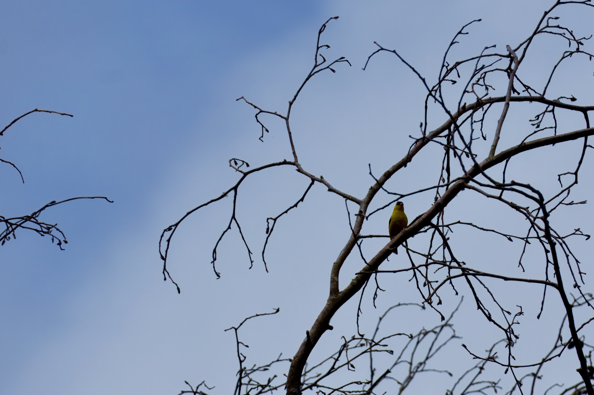
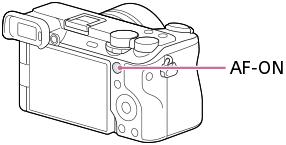
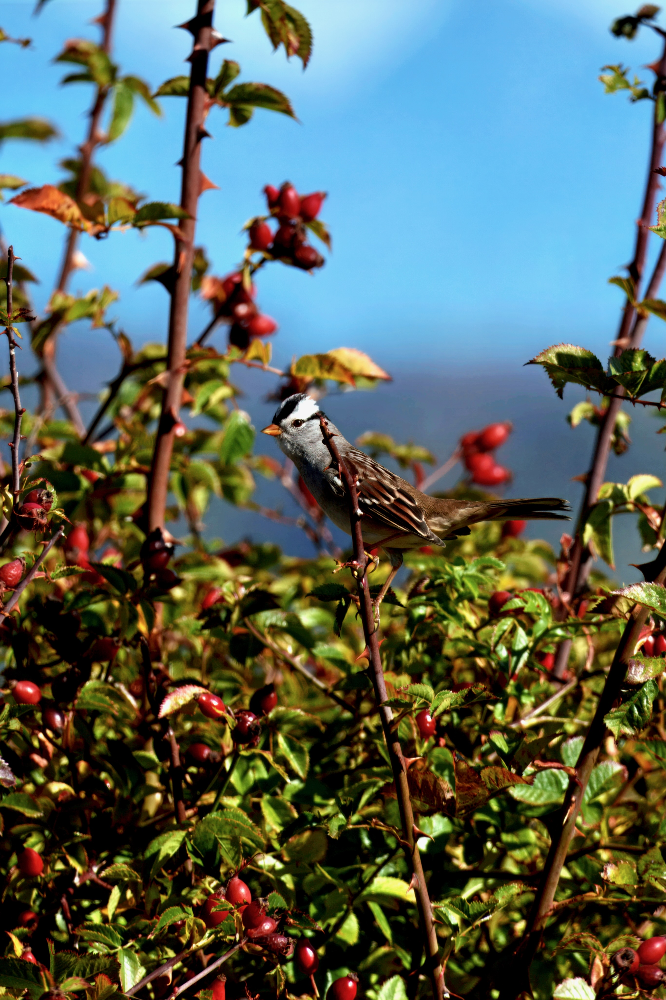
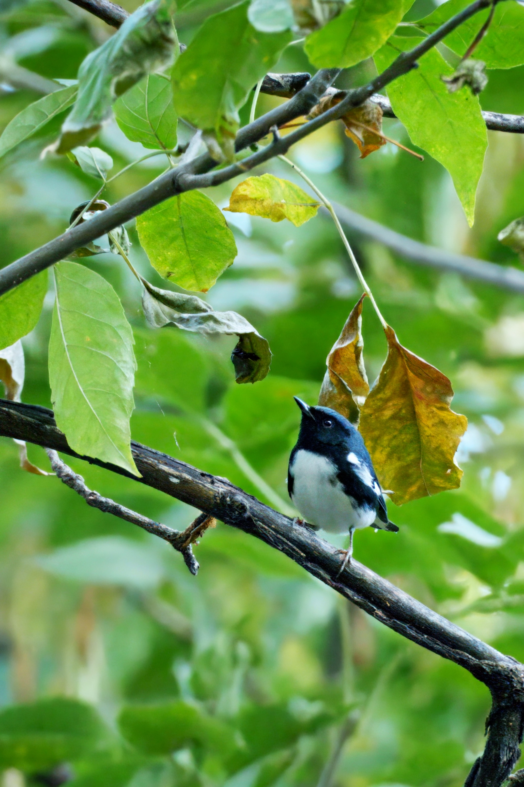
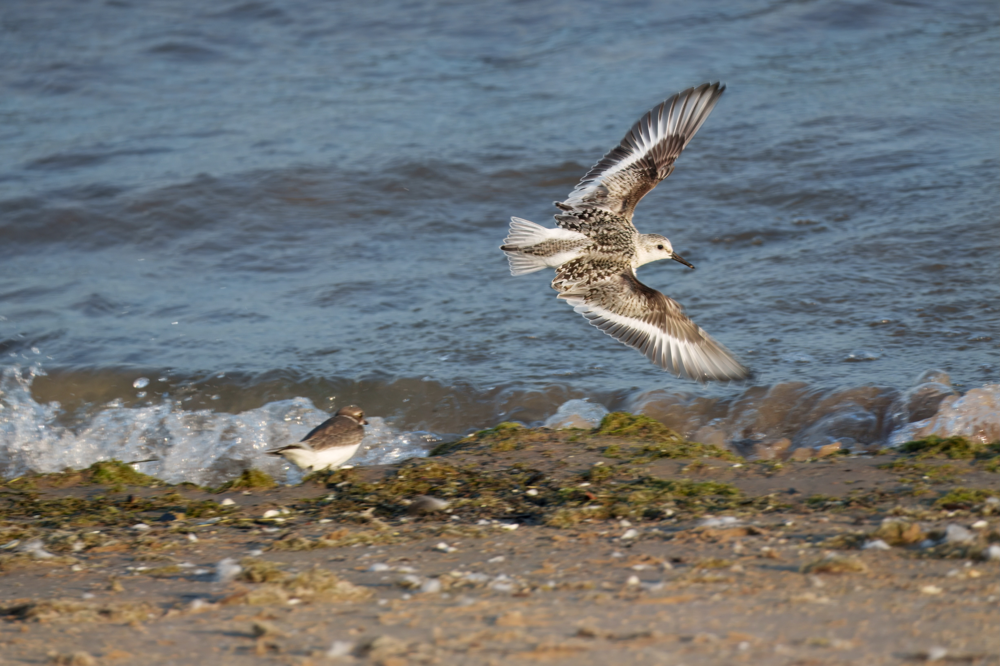

The Sony α6700's subject recognition feels magical until the bird is small in frame or the background is busy. Then "Wide + Bird" starts looking like a coin flip. If you've been frustrated by this, you're not alone[^reddit].

[^reddit]: Although I've been using this trick for a while, I felt inspired to write it up after seeing [this Reddit thread](https://www.reddit.com/r/SonyAlpha/comments/1ppwmfh/need_some_help_with_autofocus_a6700/) where others expressed similar challenges.

The fix: stop asking the camera to *find* the subject and start *telling* it where to begin.

## The problem: Wide AF with Subject Recognition can get confused

My default Focus Area is **Wide** ([why](#why-use-wide-as-default)). With **Subject Recog in AF** enabled and set to Bird, Sony [prioritizes recognized subjects](https://helpguide.sony.net/ilc/2320/v1/en/contents/211h_subject_recognition_af.html) inside or around that area.

Of course, as the area is "wide," the camera can prioritize subjects almost anywhere. Great, but not if the bird is tiny and the scene is full of high-contrast branches. Too many plausible targets.

## The solution: AF Area Registration + Tracking: Expand Spot + Reg. AF Area+AF On

What I actually want isn't "please identify the bird somewhere in this image." It's "start from *here*, and once you have it, stay with it."

Sony's [AF Area Registration](https://helpguide.sony.net/ilc/2320/v1/en/contents/0405L_reg_af_area.html) lets you register a focus area and recall it instantly with a button. Sony markets this for composition and sports, but combining it with **Tracking: Expand Spot** and the **Reg. AF Area+AF On** function gives you a superpower: one button that says "track this thing!" 

To set it up:

1. Enable **AF Area Registration**: MENU →  (Focus) → [Focus Area] → [AF Area Registration] → [On]

2. Set your focus area to  **Tracking: Expand Spot**, position it in the center[^af]

[^af]: Tracking focus areas require AF-C. If you don't see Tracking options, check your focus mode.

3. Hold **Fn** to register it (the frame will flash to confirm)

4. Assign **Reg. AF Area+AF On** to your preferred button: MENU →  (Setup) → [Operation Customize] → [ Custom Key/Dial Set.] → Select a button like **AF-ON**[^button] → [Reg. AF Area+AF On]

[^button]: The AF-ON button is great for this: it’s already ergonomically placed for back-button focusing, and using it as “track this” feels like a natural extension, no extra mental overhead. 

The **Reg. AF Area+AF On** variant is *key*. Sony [offers multiple recall options](https://helpguide.sony.net/ilc/2320/v1/en/contents/0405L_reg_af_area.html): **Regist. AF Area hold** and **Regist. AF Area tggle** [sic] just switch your focus area temporarily, while **Reg. AF Area+AF On** *also* initiates autofocus (and thus tracking via **Tracking: Expand Spot**). The latter is what makes this a true "bird button" - one press to both recall the area and start tracking.

Now the workflow is simple: I see a bird (that I don't trust Wide to pick correctly), point the bird in the center of the frame, then hold AF-ON. The camera immediately starts tracking the bird. Subject recognition still helps, but within a much tighter box instead of interpreting the entire scene.

If you tried it, you'd see it's not too different from the [classic focus and recompose technique](https://photographylife.com/focus-and-recompose-technique), except now the camera is tracking in real-time as you shoot, so no risk of losing focus if the bird moves.

## How this compares to Sony's "Track Recog Off on Hold" method

Sony's official tutorial describes a [different workflow](https://support.d-imaging.sony.co.jp/support/tutorial/ilc/ilce-6700/en/04.php) for tricky situations: assign **Track Recog Off on Hold** to a custom key, then hold it to temporarily switch from tracking back to a static Spot/Zone area when tracking gets confused (e.g., bird goes behind a branch). You'd also set up **Focus Standard** to move the focus area to the tracking frame's current position.

That method solves a different problem: *recovering* when tracking fails mid-shot. It's useful, but requires juggling three functions and careful timing.

Our method is about *initiating* tracking precisely from the start. One button, no timing dance, no mid-shot mode switching. If the scene is busy and I don't trust Wide to pick the right subject, I just center the bird and press AF-ON. Done.

The tradeoff: Sony's method lets you recover without recomposing. Ours requires you to briefly center the subject. For birds that hold still for a moment (perched, hovering), centering takes a fraction of a second. For subjects in continuous chaotic motion, Sony's recovery method might help—but honestly, if tracking is already failing that badly, I'd rather start fresh with a deliberate "track this" press.

## Why not just use "Tracking On"?

Sony has a [separate feature called Tracking On](https://helpguide.sony.net/ilc/2320/v1/en/contents/0405C_autofocus_area.html) where holding a button switches your current focus area to its tracking equivalent. Wide becomes Tracking: Wide.

That's the problem. If my default is Wide, Tracking On still starts from a broad area. I want Wide by default but a *specific* centered tracking start area when I ask for it.

## Why use Wide as default?

The issue with wildlife is that you don't always have time to place the focus point on the subject, and you definitely don't have time to use the joystick to move the focus point (unless you have pro-level APM, I guess). Hummingbirds don't hold still while you line up the focus point.

For fast-moving subjects that dart around the frame, the ability to half-press shutter and let Wide find the bird *anywhere* is valuable. I want that flexibility for the easy shots. But when Wide gets confused by a busy background, I want a quick override that says "start *here*" without fumbling with a joystick.

## Advanced tuning

Once the basics work, there are a few settings worth exploring:

- **[Tracking Shift Range](https://support.d-imaging.sony.co.jp/support/tutorial/ilc/ilce-6700/en/04.php#:~:text=Convenient%20use%20of%20tracking%20and%20subject%2Drecognition%20functions:%20Adjusting%20[Tracking%20Shift%20Range])**: How far the camera can "jump" to a recognized subject. Narrowing this helps when multiple birds are in frame.
- **[Tracking Persistence Lvl](https://support.d-imaging.sony.co.jp/support/tutorial/ilc/ilce-6700/en/04.php#:~:text=Convenient%20use%20of%20tracking%20and%20subject%2Drecognition%20functions:%20Adjusting%20[Tracking%20Persistence%20Lvl])**: How aggressively it stays locked when the subject is briefly lost.

These are second-order improvements. The big win is changing the interaction model: instead of moving a focus point with a joystick or asking Wide to guess, I use framing as the input. Center it, press and hold, shoot.

## Keeping it separate from normal shooting

If you don't want this configuration as default, Sony's [Camera Set. Memory](https://helpguide.sony.net/ilc/2320/v1/en/contents/0413_setting_memory.html) solves that by letting you register up to 3 sets of settings and recall them via the mode dial.

Me? I actually use this "bird button" so often that I've made it my default AF method, and even use it in non-birding situations (e.g., tracking pets or faces). Give it a try — it might become yours too.

