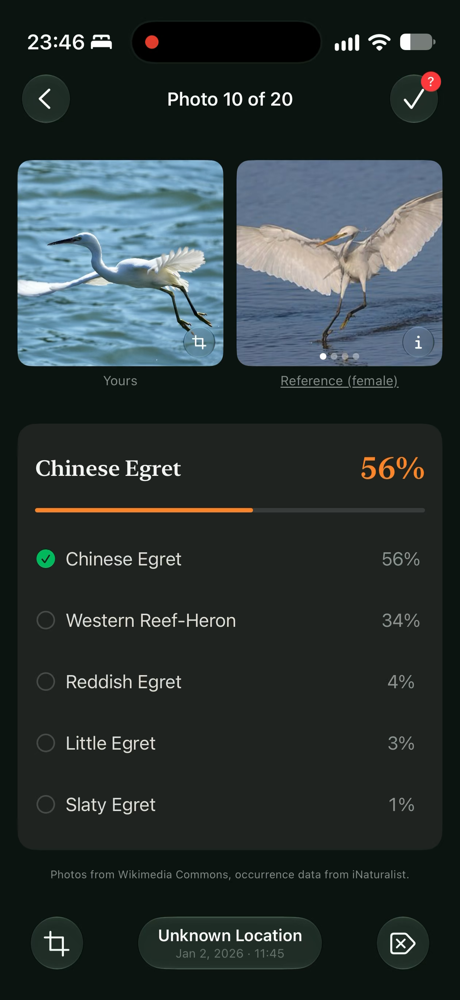
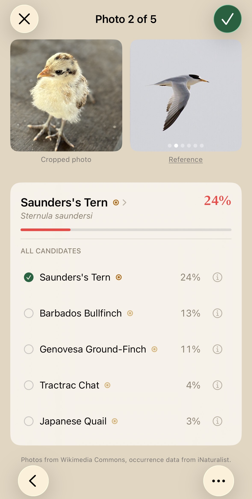
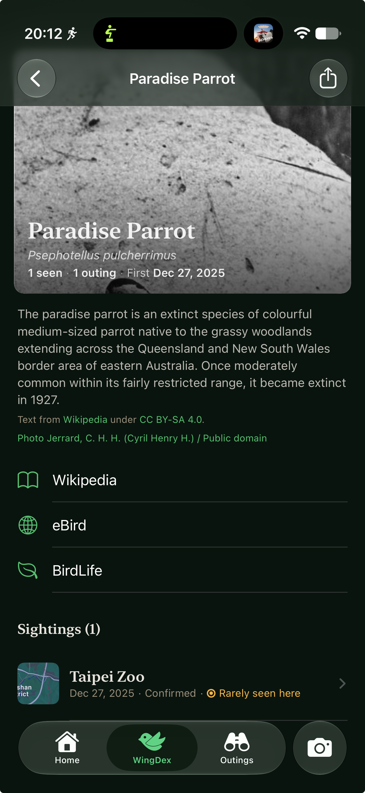
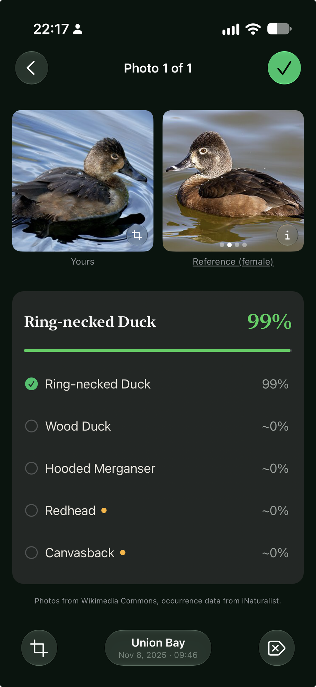
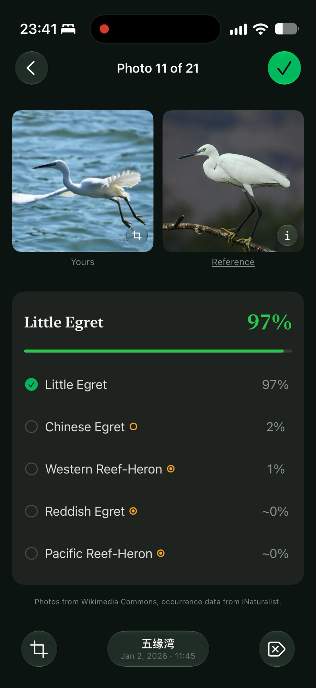
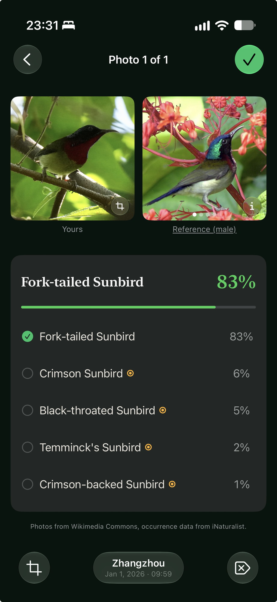

<!-- TODO(John): BEFORE PUBLISHING. config.toml sets goldmark unsafe = true, so every HTML comment in this file ships in the page source. Remove every "TODO(" comment (`grep -n 'TODO(' content/posts/wingdex/index.md` should print nothing), then set draft: false. -->

<!-- TODO(John): [P1] hero photo. The January sunbird (not photo X: vision-only already ranks Fork-tailed #1; photo X is the Xiamen Little Egret, Jan 2, in sections 7, 8 and 12). Which species, and where? Confirmed: a Fork-tailed Sunbird, Zhangzhou, Jan 1, 2026, 09:59 (screenshot placed in section 12). "Taiwan, China and Japan" and "By January 19" still read fine, since Jan 1 was mid-trip. It now also carries the section 2 thread: it was the first bird to fall through the BirdLife/eBird taxonomy gap (your memory; the repo doesn't say whose photo it was). -->

On January 19, right after a trip through Taiwan, China and Japan, I had about 100 culled bird photos from my a6700 (shot with [the bird button](/posts/tracking-expand-spot-bird-button/)), and I didn't know what most of them were, so I sat down with [Merlin](https://merlin.allaboutbirds.org/) to go through them.

Identifying one photo, an Osprey from Oaks Bottom, took 16 taps. You pick the photo, pinch until "your bird fills the box", fix the location (Merlin showed my well-tagged photo as "Lat: 45.469, Lng: -122.662", and its search only knew "Portland, OR"), identify, tap **This is my bird** and save, at which point the confirmation page says "Oaks Bottom Wildlife Refuge", so it knew all along. Then **ID another bird** sends you back to the cropping step with the same Osprey still loaded. For the folder, that's 1,600 taps.

<!-- TODO(John): [P2] Merlin screenshot strip of the Oaks Bottom Osprey loop. -->

<!-- TODO(John): [D1] diagram: the 16-step loop x100 (1,600 taps) next to "select all -> review -> save". -->

For scale, my whole life list is 170 species from a bit over 400 photos, and the biggest batch I've ever imported at once was about 50 (the tests run hundreds). This was never a big-data problem, just a lot of tapping.

Merlin is excellent at what it's for,[^merlin] and so are [Seek](https://www.inaturalist.org/pages/seek_app), which will name nearly anything you point a phone at, and [eBird](https://ebird.org/), the record the rest of birding runs on. All three are built around one bird at a time, ideally while it's still in front of you. That afternoon I asked ChatGPT "How do I use my photo library to update my life list to ebird/merlin app in the least manual way possible", and its "Option 1 (least manual long-term)" was "Start eBird checklists while shooting, attach photos later." That's good advice for a different kind of birder, and the folder sat.

[^merlin]: Especially Sound ID. Merlin is built for the moment you're looking at, or listening to, a bird. My problem started weeks after the bird had left.

<!-- TODO(John): [P3] screenshot of ChatGPT's answer. -->

I'd been given a name for my kind of birder a few months earlier. We were birding at literal sunrise at Montrose Point in Chicago when a guy with a big lens asked if I'd seen anything cool, and I told him the truth:

"I just take the pictures and figure it out later, so I have no idea what I've seen."

"Me too. It's called reverse birding."

I assumed that was an established term; today the top Google result for it is the WingDex repo. There are more than 150 bird identifier apps, and I couldn't find one that would take a whole folder of photos after the fact. Three weeks after the trip a coworker mentioned [GitHub Spark](https://github.com/features/spark), and I asked ChatGPT for ideas: "What about that reverse birding app I told you about where using merlin is super annoying because I can't bulk upload pictures and have it automatically parse the location/time and update my bird-dex". It suggested a "Bird-Dex backfiller".

<!-- TODO(John): [P0] screenshot the "reverse birding" Google results before they change. -->

<!-- TODO(John): source for "more than 150" (App Store search? which date?). -->

## Vibe-code an app

Spark builds an app from a prompt and commits each prompt as the commit message, so the [WingDex](https://github.com/jlian/wingdex) history starts with me talking. The first real commit, on February 12, begins:

> Build a mobile-first web app called "Bird-Dex" that is its own bird life-list + sighting tracker, and is compatible with eBird (import/export) and Merlin (Merlin-like life list UX + optional eBird bridge).

It goes on for a while. About an hour of follow-up prompts later, the log looked like this:

<!-- TODO(John): [P4] optional: swap this block for a screenshot of the four commits on GitHub. -->

```text
26215614 Generated by Spark: Ok still no cropping and still no bird ID
ddab6d46 Generated by Spark: Why is there still no crop? Are we doing AI crop? I was thinking user crop. Maybe it could be AI crop first and then user confirm?
250f8924 Generated by Spark: I'm still not seeing a crop box or any indication of AI crop
e1326575 Generated by Spark: Nope, all the same issues I just mentioned none are fixed, no crop, no outing location detection, and no bird ID
```

Within a day it did the thing I wanted. I selected a pile of photos, it rebuilt my outings from each photo's EXIF time and GPS (anything within eight hours of each other became one outing), and I reviewed the birds. Spark was a good way to prove the workflow, and from then on anything that shipped had to get past a test or a measurement first.[^upload-button]

<!-- TODO(John): [P-app] one of your existing App Store screenshots of the batch review flow (select a folder -> outings -> review). Placeholder only. -->

<!-- TODO(John): busiest commit day. As recorded (mixed time zones), Feb 13 has 87 commits; in Pacific time it's Feb 12 with 83. Use one here or cut it. The old "84 on Feb 15" came from committer dates and is wrong. -->

[^upload-button]: The exception was the upload button, which went through twelve commits in 31 minutes on February 15, from "premium upload button with gradient, layered shadow, hover lift" through "premium circular", "refined rectangular", "inline text" and "square upload button with icon above text, right-aligned" to "slightly larger Add button (px-6 py-3, text-base)". Three hours later it got one more: "less rounded Add button". <!-- TODO(John): the outline says 15 commits; I count 12 in 31 minutes (02730a2f..15cd38cc), 13 with 53802f05. -->

## Ask GPT, then map the world

The first real version sent every photo to GPT (gpt-4.1-mini at first, later gpt-5.4-mini), with a quick pass and a second, stronger pass whenever the first one wasn't sure. The prompt included where and when the photo was taken. Each photo took a couple of seconds and occasionally 13, so I sized the progress bar for 10. GPT also handled several things I didn't think about at the time because they came free: it drew a crop box around the bird, said plainly when there was no bird, gave separate answers when there were several, and added a note about the plumage.

<!-- TODO(John): [D2] architecture frame 1: photo -> server -> GPT, with the range blobs in R2. -->

My wife had become the QA department by then. Her first dozen issues, filed over two evenings in February, were about passkeys, time zone ordering and avatar centering, and in March she moved on to the identifications. On March 4 she filed #216:

**Isn't this just a chicken?**[^junglefowl]

<!-- TODO(John): consider crop/size/pairing -->


[^junglefowl]: Technically a chicken is a Red Junglefowl, and that's a species WingDex can answer with. eBird also has "Red Junglefowl (Domestic type)", which WingDex only knows how to display.

And later that month, #238:

**High as duck**

<!-- TODO(John): consider crop/size/pairing. The meme's caption includes the uncensored word. Also: ask your wife before featuring her screenshots. -->


The next reasonable step was a range map of every bird on Earth. On March 20 I rasterized [BirdLife International's](https://datazone.birdlife.org/) range maps onto a 27 km grid,[^ebird-no] which came to 10,144 species across 681,023 cells, stored as 681K little blobs in R2.[^tailwind] As I remember it, the first bird to fall through the gap between two taxonomies was the sunbird from the top of this post.[^taxonomies]

<!-- TODO(John): this sentence assumes the hero photo [P1] is the January sunbird. If it isn't, say "a sunbird I'd photographed in January" instead. -->

Every candidate GPT suggested then got a multiplier for where the photo was taken: 1.0 if the bird lives there, 0.85 if it's near its range and 0.5 if it's out of range. That fixed some wrong IDs. It could also punish a right one, which I'd find out in April.

<!-- TODO(John): the outline puts the "dominance gate" (ignore geography when the photo looks certain) here, but I can't find it in the March code. The term shows up in ml/README (E2) for the on-device era, so I've left it for 8.2. Confirm. -->

[^ebird-no]: Why BirdLife and not eBird: on March 16 at 6:36 PM I emailed the Cornell Lab to ask for written consent, under Section 3d of the eBird Status & Trends terms of use, to use its weekly relative-abundance estimates as a server-side prior that users would never see, with citation and the required disclaimer. At 6:59 PM I started building it, and the branch had 18 commits by 10:33 PM. On March 19, still waiting, I started over on BirdLife, and on March 24 Cornell replied that the use case "falls out of the intended use of eBird data", and the branch was never merged.

[^taxonomies]: The 10,144 are the species that matched. The night the range maps shipped, about 1,183 of BirdLife's maps matched nothing in my eBird-based species list, and my own sunbird photo, taken in Zhangzhou on New Year's morning, was one of the casualties. My reaction was roughly "omg, this can't be real, my own bird pic": I thought scientific names were in Latin precisely so that they'd be standardized, so how can there be *competing* bird taxonomies? I thought I was taking crazy pills. The rules for *naming* a species are standardized; deciding *which populations count as separate species* is a judgment call, and each checklist (eBird/Clements, BirdLife/HBW, IOC, Howard & Moore) splits and lumps differently. The Latin is standardized, but what it refers to isn't. [AviList](https://www.avilist.org/), published in 2025, is the first attempt at one unified global list, so I built a crosswalk through it that matched BirdLife's splits back to eBird's lumps by their original names. That recovered 223 species and cut the unmatched maps to about 630; for example, BirdLife's *Aethopyga latouchii* is eBird's Fork-tailed Sunbird. The range maps were deleted along with GPT in August, and the crosswalk script survives only because its second half fills in the IDs behind the BirdLife factsheet links in the app.

[^tailwind]: For a while, local dev kept 360k+ of those blobs as loose files inside the project folder. Tailwind v4 scans the project for class names, so it read every one of them, and loading `/` locally took 28 seconds.

## Move to Cloudflare

Spark was a good place to find out whether any of this worked, but not a place to keep it. On February 22 WingDex moved to [Cloudflare](https://developers.cloudflare.com/workers/) Pages with a [D1](https://developers.cloudflare.com/d1/) database, and on April 18 to Workers, mostly for the logs. A SwiftUI iPhone app followed on TestFlight.[^ios-100]

Cloudflare was partly a reaction to my [last post that did well on Hacker News](/posts/hdmi-cec/), which pushed this site's old host into paid usage and got the site itself moved to Cloudflare a month later. The rule I came away with is that **a surprise audience shouldn't become a surprise bill**, and Cloudflare's free tier covers a lot if you design to stay inside it. Paying OpenAI for every photo anyone uploaded broke that rule, but I didn't have a better option yet.

<!-- TODO(John): confirm the old host was Netlify and that the HN spike is why you moved (this repo: CF Pages migration Dec 16, 2025; Netlify config removed Dec 21). Name the host or keep it vague. -->

[^ios-100]: On March 10 the release bot decided the very first iOS build was 1.0.0 and published it, and I reverted it 13 minutes later. The real 1.0.0 comes up again at the end. <!-- TODO(John): the outline says the release notes were the whole project history. The GitHub release is gone, so I couldn't verify; confirm or cut. -->

## Name it, trademark it, get scammed

The app had already been renamed twice: the first Spark prompt called it "Bird-Dex", and by that evening it was "BirdDex". On February 16 at about 10:30 PM I opened #104, **Maybe need a new name**, which starts:

> Too many "birddex" and variants out there. Need something more creative.

The issue has a table of names already taken (Birdex, FeatherDex, Lifer!, Birda and seven more) and five categories of candidates, including Wingsnap, Shutterbird, LensLark and Aperch. I picked WingDex. I honestly thought it was genius. The rename landed the next morning, and that evening at 8:49 PM I sent ChatGPT a photo of the bottle on my counter:


It came back with four logos, all of them extremely Windex:


Three minutes later, at 20:52 by my phone clock, I changed direction:


What stuck was the editorial look and the nod to *Wingspan*,[^wingspan] and today the icon is a green bird with nothing about it that says glass cleaner.

[^wingspan]: The board game [*Wingspan*](https://stonemaiergames.com/games/wingspan/). I have bought exactly three board games in my life, *Pandemic Legacy*, *Concordia* and *Wingspan*, and I bought *Wingspan* before I ever took a bird photo.

Five days later, on February 22 at 7:11 PM, my wife filed #167, **WingDex is also a butterfly identifier app 🧐**, and she was right. I had named the app after a cleaning product specifically to be original, and it collided with a butterfly app anyway.

The same developer had about 30 other *Dex apps, one for seemingly every family of animals, and the butterfly one has since disappeared from the App Store. I didn't want to rename again, and my research said a trademark would settle it, so I applied that night with my real email, phone number and home address, which I now know is what a lawyer's office or a forwarding service is for. The web app was already live, so that class was filed as "in use". The iPhone app didn't exist, so that class was "intent to use",[^itu] which amounts to a legal promise to the US government that I will ship an iPhone app.

<!-- TODO(John): confirm the filing date. The outline says Feb 22 (the night of #167); in the planning chat you remembered "March I think". The USPTO record (serial 99664749) has it. Redact application details from any screenshot. -->

The phone call that woke me up the next morning was from someone on a "federally recorded line" who said I owed a one-time declaration fee to keep my trademark valid for 10 years, after which an assigned IP attorney would contact me. I was half asleep with a meeting in 30 minutes, so I paid the $575 with a one-time-use virtual card, figuring the worst case was a chargeback. The charge showed up from a merchant called "The Cadet", the USPTO record showed nothing the caller had described, and after I disputed it Robinhood ruled in my favor and I got $500 back. I also reported it to the USPTO, the FTC and the FBI's IC3. Trademark filings are public and get scraped within hours, so if you file, use a lawyer's address or a forwarding service, and read the USPTO's [warning about misleading notices](https://www.uspto.gov/trademarks/protect/caution-misleading-notices) before you answer the phone.

[^itu]: In the US you can file for a trademark before you use it, as long as you swear you intend to. Once the application is allowed, you have six months to file a Statement of Use showing you've actually started, extendable to three years, or the application dies. The USPTO explains it [here](https://www.uspto.gov/trademarks/apply/intent-use-itu-applications).

## A San Diego heron, in San Diego

On April 5 WingDex flagged a Yellow-crowned Night Heron in San Diego, where they're regulars, as **out of range**. I filed #242 that afternoon ("Yellow crowned night heron should be in range in San Diego"), and the investigation in #243 found that BirdLife's nearest cell for the species was on the coast of Texas, so the 0.5 multiplier had cut a correct answer in half. The fix raised it to 0.65. That was the whole fix, and it wasn't a satisfying one, because nothing in the code was wrong. BirdLife's maps are expert-drawn ranges built for conservation, and at 27 km per cell they were coarse in exactly the place I happened to be, which isn't their fault and wasn't something I could fix.

<!-- TODO(John): [P7] the heron photo and the "out of range" UI. Was it your photo? The prose above avoids saying so. -->

That was demoralizing after how much work the range map had been. Then Diablo 4 season 13 came out, and after that the project sat. There isn't a single commit between April 21 and July 20.

<!-- TODO(John): [D5] commit timeline, captioned only "Commits per month." Mark the trademark dates. Pacific-time author dates on main: Feb 574, Mar 312, Apr 13, May 0, Jun 0, Jul 44, Aug 386, Sep 101 (1,430 total, recount on publish day). -->

## A letter from the USPTO

On July 20, around 3 PM, the USPTO told me the WingDex trademark had been approved for publication. I asked an agent whether the notice was legit, and added "I need some motivation to finish working on WingDex and publish it to the App Store." It was legit, and it was a reminder: the web class was fine, but the iPhone class was still a promise. After the Notice of Allowance I'd have six months to ship an app and file a Statement of Use, and each six-month extension after that is a fee, which is paying the USPTO rent on an app that doesn't exist.

At 5:47 PM I asked, almost verbatim, "Does iOS 27 have on-device models that can be used for WingDex instead of GPT? Can you look it up?" It does, but Apple's on-device model is a generalist, and Apple's own guidance is to hand fine-grained work like species ID to a specialist.[^apple] Merlin's model is a purpose-built specialist, but it's private. The best open one I could find was [BioCLIP-2](https://huggingface.co/imageomics/bioclip-2), an MIT-licensed model trained on 200 million photos of living things, and on my 27-photo golden set it beat GPT, both on the first guess and in the top five.[^golden] So a specialist wasn't just cheaper and offline, it was better. It was also 307 MB.

<!-- TODO(John): [C0] optional "Why not CLIP?" chart: general CLIP models on birds. -->

The sensible plan was #259, a hybrid: BioCLIP-2 on the device when it's cached, GPT otherwise. Nine minutes later I opened #260, "R&D: distill and benchmark a sub-25 MiB bird-only BioCLIP-2 student", and that one took over the next month. On August 5 I deleted the GPT path entirely. Identifying a bird stopped costing anything, so accounts became optional, and WingDex went back inside the surprise-bill rule.

The price was everything GPT had given me for free in March: the crop box, "there's no bird here", separate answers for several birds, and the plumage note. The photos themselves never leave the device now; the [privacy policy](https://wingdex.app/privacy) has the rest.

<!-- TODO(John): [D2] architecture frame 2: everything on the device; the server syncs records and names places. -->
<!-- TODO(John): check the privacy policy URL. -->

[^apple]: <!-- TODO(John): quote and link Apple's Foundation Models guidance about calling a specialist model through tool calling for things like plant or species ID. ml/README says "Apple sends species ID to a specialist model through tool calling" but doesn't cite the page. --> Apple's Foundation Models documentation.

[^golden]: The golden set is 27 photos with known answers. BioCLIP-2 with range gating got 87% top-1 and 96% top-5; GPT got 83% and 87%.

## Train my own model

The idea is called distillation. You show a small model (the student) the same photos as a big one (the teacher) and train it to produce the same embedding, the teacher's numeric summary of what's in the picture. Species are never a fixed list of outputs: the app compares a photo's embedding against embeddings of the species names as text, so all 11,167 names stay predictable even for birds the student never saw a photo of.[^funnel]

<!-- TODO(John): [D7] distillation diagram. [D10] model family tree, versioned like a frontier lineup (WingCLIP-0.1-alpha/beta, 0.1, 0.2-alpha retired, 0.3-alpha/beta, 0.3). -->

The setup was 2.5 million iNaturalist photos of 7,555 species on a NAS, and the RTX 3080 in a closet PC called `tomahawk`.[^tomahawk] I left out the ShareAlike photos, credited all 62,423 photographers, and kept the weights non-commercial, because iNaturalist's photos are, which gives me a weird sense of peace that WingDex can only ever lose money.[^corpus] Photos from the same sighting look nearly identical, so the held-out sets exclude whole observations, not just photos. My first training loop ran at 40 images a second. Switching to the [open_clip](https://github.com/mlfoundations/open_clip) reference structure, and from loose files over SMB to 251 WebDataset shards, got it to about 720, and I learned not to trust the GPU utilization number in `nvidia-smi`.

Then came the waiting. A recipe pilot on 500 species took 3 to 4 hours, and a full run took 30 to 40; the longest one written down in the model card is about 41 hours for 35 epochs. The 3080 ran through most of the summer, and I found out that babysitting 40-hour training runs is physically tiring, which I didn't expect from a job that is mostly waiting.

<!-- TODO(John): number of recipe pilots, number of full runs, total GPU-hours (also for chart [C6] "Training compute"), and the calendar span (first distill commit Jul 21; web ship Aug 5-7; crop fix and probe Aug 25). -->
<!-- TODO(John): the RTX 3080, "a good soldier": anything it survived? The two-jobs-at-once lockup is already a README rule. -->

The first student, WingCLIP-0.1, did what distillation does and landed just under its teacher. Then I fine-tuned it on real species labels, and it passed BioCLIP-2 on the NABirds test split I'd been checking against all along.[^wiseft] On my golden set, though, it got the first guess right less often than BioCLIP-2 had. The same thing is easy to see in the app today by switching location off.

On January 2 I photographed a Little Egret at 五缘湾 (Wuyuan Bay) in Xiamen. The egret is Xiamen's city bird: the city's nickname is 鹭岛, "Egret Island", the logo of [Xiamen TV](https://en.wikipedia.org/wiki/Xiamen_Media_Group) is a stylized egret, and the central park is [Bailuzhou Park](https://www.tripadvisor.com/Attraction_Review-g297407-d2051173-Reviews-Xiamen_Bailuzhou_Park-Xiamen_Fujian.html) (白鹭洲公园), named for the same bird. Without being told where it was, WingDex looked at my hometown's city bird and said Chinese Egret, at 56%.[^merlin-egret] Little Egret came fourth, at 3%.

<!-- TODO(John): the park link is TripAdvisor because I couldn't find a neutral page (zh.wikipedia's 白鹭洲公园 is the Nanjing one). -->

[^merlin-egret]: Merlin gets this one right, with or without location. Merlin is good.
<!-- TODO(John): replace with designed R-card [R1]: vision-only top 5 with similarity bars. -->
<!-- TODO(John): consider crop/size/pairing (the two egret screenshots could be a side-by-side pair here and in section 12). -->



[^funnel]: The numbers get questioned every time, so: 11,167 species in the taxonomy, 7,555 with at least 50 open-licensed research-grade photos on iNaturalist to learn from, and 3,850 with enough held-out photos to fine-tune on. Classification is zero-shot against the text of all 11,167 names, so a species needs a name, not training photos, to be predictable. The weak tail is real, though, and it's tracked in #370.

[^tomahawk]: It's a Razer Tomahawk gaming desktop I bought in 2021 or 2022, when a prebuilt was the only way to get an RTX 3080 without scalper markup. <!-- TODO(John): confirm the year. -->

[^corpus]: The weights are CC BY-NC 4.0, with a per-photo `attributions.csv`. Non-commercial carries through from the photos: iNaturalist doesn't allow training commercial models on them. The details are in the [model card](https://github.com/jlian/wingdex/blob/main/ml/README.md), which is long, sorry. <!-- TODO(John): pin this link to a tag. Also fix the `prep_training_set.py` docstring that still says "MIT weight release". --> Splitting by photo put 56.5% of the validation photos in the same observation as a training photo.

[^wiseft]: 81.83% top-1 on NABirds for the pure distill, 89.93% after fine-tuning with a [WiSE-FT](https://arxiv.org/abs/2109.01903) blend, against 86.41% for BioCLIP-2, all on the 24,633-image test split. The blend is the trick: fine-tuning alone makes a model forget what it knew, so you average the fine-tuned weights with the originals and pick the mix that scores best.

## Fix the ranking

### The clue

The golden-set miss looked like a recognition failure, and it wasn't. The student's top five matched the teacher's 96%: the right bird was almost always on the list, just not first. The model usually recognized the bird; the product still had to rank it.

<!-- TODO(John): confirm the student's golden-set top-5 used the same range-gated setup as BioCLIP-2's 96% in [^golden]. If it didn't, reword this. -->

<!-- TODO(John): [R2] the egret card again, Little Egret highlighted at #4 (until the designed R-card exists, the location-off screenshot above stands in). [C1] launch-style bar chart, top-1 vs top-5, NABirds, with the setup in the subtitle. -->


### Why the range map couldn't fix it

The old reranker was a stack of hand-tuned rules: a confidence floor, the tier table from March, and a "dominance gate" that ignored geography whenever the photo looked certain. It mostly worked when the gate switched the tiers off. The deeper problem was that a range map says whether a bird is *possible* somewhere, and ranking needs to know whether it's *common* there. The egret is a good example. Chinese Egret really does breed on islands off Fujian, but in summer, and it mostly winters farther south, so in January it's possible there without being common. Western Reef-Heron and Reddish Egret are on the wrong continents.

<!-- TODO(John): [R3] designed R-card: the egret with the old x0.5 rule applied (no real screenshot exists, since the BirdLife path is deleted), San Diego heron as an inset. If you have a number for how little the hand tiers beat vision alone, put it in a footnote; I couldn't find one in ml/README. -->

### One fitted score

The replacement is a Bayes-style rerank. It takes what the photo says and weighs it by how common each bird is at that place in that month, added together in log space:

```text
score = sim/T + beta * log P(species | cell, month)
```

`sim` is how closely the photo matches each species name, and `P` comes from iNaturalist sightings counted on the same 27 km grid. `T` and `beta` are two knobs, how much to trust the photo and how much to trust the map, fitted on labeled photos instead of set by hand.[^bayes] Strong visual evidence now beats a bad prior on its own, which is what the dominance gate had been faking.

<!-- TODO(John): [R4] designed R-card: the egret with the fitted prior, a sim/T bar plus a beta*logP bar per candidate. -->

### What the world range map was worth

iNaturalist sightings did the heavy lifting, and adding the month helped a little. Adding BirdLife on top was worth 0.30 points, and on August 5 the 681K-blob range system went out with GPT. Every test photo came from iNaturalist and so did the prior, so as a sanity check that the prior wasn't flattering itself, I also fit one from GBIF with iNaturalist excluded, which is mostly GBIF's public, CC BY 4.0 [eBird Observation Dataset](https://www.gbif.org/dataset/4fa7b334-ce0d-4e88-aaae-2e0c138d049e). It never left testing, and its fitted weight came out to exactly 0.0.[^ablation]

<!-- TODO(John): [D13] ablation bars (iNat, +month, +BirdLife, GBIF). -->

### The 99.9999% vulture

One version of the fit treated a species' absence from a cell as a soft hint instead of strong evidence, which is kinder to vagrants, and the optimizer responded by dropping geography entirely. Another setting identified an extremely blurry silhouette from Guatemala as a Black Vulture at 99.9999%. It was right (I saw them up close later), but no photo that blurry should make anything that sure, and a calibration bug that happens to be correct is still a calibration bug. I refit everything together, and the vulture is now a regression test.[^nan]

<!-- TODO(John): the blurry original, if you still have it, side by side with the 99.9999% card and a later sharp photo. -->

### Where it stops helping

A prior can only separate birds that live in different places. Lookalikes that share a range, and places where hardly anyone has logged anything, are left to the photo. In #355 the right bird for a spot in Guatemala came in around 12%, behind a Blacksmith Thrush from about 6,000 km away, because the cell had nine observations for August. I tried eight variants of the backoff, and nothing beat the shipped constant, so I stopped tuning.

[^bayes]: Textbook Bayes would divide out the training set's species mix before multiplying by the local prior, because the model's output already reflects how often each species appeared in training. It barely matters here, because the corpus has a floor of 50 and a cap of 500 photos per species, so the training mix is fairly flat. What's left is up to a 10x spread between floor and cap, plus whatever skew BioCLIP-2 (trained on the uncapped TreeOfLife-200M) passed down. Fitting `T` and `beta` by log loss is calibration, not inference.

[^ablation]: On the iNaturalist calibration split: the iNaturalist prior is worth +15.05 points of top-1 over vision alone, the month +1.2, and BirdLife +0.30 on top. A two-year-stale prior costs 2.88 points, so it gets refreshed quarterly. The GBIF check used the same 27 km grid, and naively adding its counts to iNaturalist's cost 1.44 points. My guess is that eBird checklists record what birders go looking for, not what people photograph, and the test photos are iNaturalist photos, so the iNaturalist prior has a home-field advantage.

[^nan]: Another regression test exists because of a month that wasn't a number. `NaN < 1` and `NaN > 12` are both false, so a missing month passed the range check, and then `| 0` turned it into January.

## Make it fit

WingCLIP-0.1 was too big to ship, so I distilled again, into [TinyCLIP-39M](https://huggingface.co/timm/vit_medium_patch16_clip_224.tinyclip_yfcc15m), with my own model as the teacher this time. That's where an agent earned its keep: the training shards had the teacher's embeddings baked in, so a run with a new teacher would quietly train against the old one, and it caught that before a day-long run started.

<!-- TODO(John): the outline says "20 minutes before a 24-hour run". I couldn't find that in the repo (ml/README only documents the shard-baked-target trap). Confirm the numbers. -->

The last run converged shakily. By then my rule was that if it beats BioCLIP-2 on the benchmark, it ships, and it did. The student, WingCLIP-0.3, matched BioCLIP-2 on NABirds at about an eighth of the size.[^benchmark]

<!-- TODO(John): [C3] headline benchmark, launch style: WingCLIP-0.3 vs BioCLIP-2, BioCLIP 2.5, CLIP B/16, CLIP L/14, SigLIP. Subtitle: "NABirds, 48,527 images, 11,167 labels. Birds only." [C5] parameters, launch style: WingCLIP's bar a sliver next to BioCLIP-2 and BioCLIP 2.5. [C4] optional speed vs size bubble. -->
<!-- TODO(John): the shaky-convergence loss curve, if it's visibly wobbly. -->

Then it had to get smaller. fp16 was free and int8 was fine; int4 lost just enough to miss the bar, and int3 and int2 fell all the way to 0%, not noisy but destroyed. The agent's first int8 number was flattering because it came from simulated quantization in PyTorch, so we measured the actual shipped ONNX file instead, which agreed with the full-precision model a little less often.[^fakequant]

<!-- TODO(John): [D16] quantization cliff. -->

The real Cloudflare constraint turned out to be per file: Workers serves static assets up to 25 MiB each. The int8 model ships as a 13.72 MiB graph plus a 24.00 MiB data file, with 1 MiB to spare, so the "sub-25 MiB" student #260 asked for is 37.72 MiB, in two files that are each under 25. In the browser, WebAssembly beat WebGPU, so the app ships WebAssembly only.[^wasm]

<!-- TODO(John): [D17] the 25 MiB split. -->

The best bug was in the crop. TinyCLIP was trained on photos resized to 248 pixels and then center-cropped to 224, which is the middle 90% or so of the frame, and WingDex had been resizing straight to 224. Since the first web build, the model had been seeing an 11% wider view than the one it was trained on, and every parity test agreed with the app, because they all used the same wrong transform. The fix was one constant, `CLIP_RESIZE = 248`, and it changed the top answer on 4.8% of photos. (Nine of the iOS parity tests had also never run in CI.)

[^benchmark]: NABirds, all 48,527 images against 11,167 labels, on one harness: WingCLIP-0.3 86.84% top-1, BioCLIP-2 86.31%. [BioCLIP 2.5](https://huggingface.co/imageomics) is stronger at 90.31% and about 16x larger. Supervised models with a fixed class list score higher still (EVA02, 94.60% on its 10k classes), and general CLIP models land between 25% and 33%. <!-- TODO(John): fix the BioCLIP 2.5 link. -->

[^fakequant]: Simulated int8 agreed with fp32 on 99.27% of top-1 answers; the real integer kernels in the shipped ONNX agreed on 97.64%.

[^wasm]: 318 ms per photo on WebAssembly against 516 ms on WebGPU, and WebGPU also needed 1.75 seconds to set up and a 25.58 MiB runtime bundle. Decoding needed work too: asking the browser to scale JPEGs during decode took 27 test photos from 1,338 MB of pixels to 99 MB, and the worst single photo from 102 MB to 2 MB.

## Dogs are sometimes owls

Every label the model knows is a bird, so anything that isn't a bird becomes the most plausible bird. The model card puts it better than I can: "A squirrel does not get to be unlikely, it only gets to be a slightly worse Carolina Wren." No confidence threshold separates birds from not-birds without throwing away real birds,[^threshold] so on August 25 I shipped a separate bird/not-bird check that can decline to answer. The code comment describes it as "a cheap filter on the common case, not a detector".

A week later my wife tested it on dogs. #387, "Dogs are sometimes owls":

> Tested 12 photos of dogs. 8 were identified as birds, 4 correctly rejected.
>
> **Every false positive was an owl**, across four species: American Barn Owl (82%, 34%, 28%, 24%, 14%), Western Barn Owl 28%, Stygian Owl 62%, Buff-fronted Owl 29%.

Her report goes on to note that "Owls are the only birds with forward-facing eyes set in a flat facial disc," and that an earlier build had returned Barn Owl at 100% for a photo of a person. Two days later she filed #401:

**This is actually just a baby chicken**

<!-- TODO(John): consider crop/size/pairing -->



I left the filter where it is. It's tuned so that about one real bird in 200 gets wrongly turned away, and moving it to catch more dogs would turn away more birds.

<!-- TODO(John): [R6] the candidate card for one of her dog photos (the owl case): the prior makes the wrong local bird more confident; the check declines. Ask her first. [P14] her issue titles as a stack of screenshots: #216, #238, #387, #401 (grab the #387 screenshots). -->

[^threshold]: Measured on 20,105 hard negatives (mostly other wildlife): rejecting 95% of them would also reject 29.6% of real birds. An earlier version of this experiment reported that one threshold "keeps 100.0% of birds for free". It didn't; the birds and the non-birds had been scored by two different scorers. The model card now has a rule that every gate comparison uses one scorer.

## Build a reverse geocoder for birders

The last problem was names. A photo's EXIF has coordinates, and an outing needs a name like "Union Bay Natural Area". Plenty of reverse geocoders cover the whole planet, but they answer "what's the address here?", and a birder asks "what's this spot called?" The answer to that is a park, a marsh, a reserve or a lake. It's never a street address, and it's never the neighborhood. I couldn't find a service that answers the second question.[^hotspots]

The first version went through [Nominatim](https://nominatim.org/), whose public API allows one request per second, globally, so I built a proxy with a shared cache and request coalescing so that every WingDex user could take turns with that one slot. Two days later I switched to Geoapify, which was better and still returned addresses. Next I tried a nearest-named-place lookup over Wikidata, which was close: Montrose Point came back as "Montrose Point Bird Sanctuary". Standing inside Discovery Park returned Kiwanis Ravine, which is a real place inside Discovery Park and not what anyone would name the outing. Nearest-point is the wrong ranking for big places. The missing piece was polygons: which place are you standing *in*?

<!-- TODO(John): the outline says "a distributed lease so every Worker could share that one slot". #300 describes a D1 cache and in-flight coalescing for Nominatim's 1 req/s, but I couldn't find a lease. Confirm the mechanism. -->
<!-- TODO(John): [P10] Discovery Park: Wikidata centroid (Kiwanis Ravine) vs the park polygon. -->

What shipped is OpenStreetMap's parks, reserves, lakes and other named places, tiled into one 1.53 GiB [PMTiles](https://docs.protomaps.com/pmtiles/) archive on R2. A lookup takes 18 ms, and on 20,000 iNaturalist coordinates the share that got a real name went from 81.5% to 93.2%.[^twice] One planet build took 96 minutes, and there were many.

<!-- TODO(John): typical end-to-end rebuild time and how many rebuilds; how much scratch space Tippecanoe wanted; which size limit the OSM filter had to fit (R2 free storage? a per-object or Worker limit?) and the sizes before and after. -->

The hard part was deciding what counts. I had to choose which kinds of OpenStreetMap places a birder would name an outing after, and rank them, and there's no labeled dataset for "good birding place name", so every rebuild was judged by eye against coordinates I knew, which made me the labeled dataset. The full story, including the forward search that's built but not shipped,[^forward] is its own post.

<!-- TODO(John): how many sample coordinates you eyeballed per round, and the ranking rules you ended up with (parks > protected areas > water > ...?). Link post 2 once it exists. -->

[^hotspots]: eBird hotspots are exactly "what birders call this spot", but they're eBird data, and I'd already asked about using eBird data once, in March. <!-- TODO(John): also true that hotspots are points, not areas, so they'd hit the same nearest-point problem as Wikidata? Add only if you confirm. -->

[^twice]: Along the way, every closed park and lake was being tiled twice, once as an area and once as a line, which nobody noticed at first because comparing feature ids showed zero duplicates. The area id is the way id times two. <!-- TODO(John): add the WSL disk story here or as its own footnote once you've confirmed the numbers: a misconfigured planet build filled the SSD and locked up the instance; notes say 12 MB free, Optimize-VHD reclaimed 0 bytes (ext4 never sent TRIM), cloning to a new disk got 355 GB back. None of that is in the repo. -->

[^forward]: Forward search is typed place search. The index is 3.6 million rows and 852 MB, and D1's free tier caps a database at 500 MB. <!-- TODO(John): update if it ships before the post. --> Ranking was hard in the other direction too. In forward search, typing "Central Park" returned the wrong one, because two obscure Central Parks carrying a top tourism tag outscored New York's. <!-- TODO(John): the outline's "521 Central Parks, and Tajikistan outranking New York" isn't in the repo; PR #350 only says two obscure Central Parks outscore New York. Confirm or keep this version. Note this came from forward search (#350), not reverse geocoding. -->

## Ship it

The last month was hardening: Core ML on iOS, the prior bundled for offline use, RAW files, batches of hundreds, and the bird/not-bird check.[^d1]

It also turned out WingDex could identify extinct birds. The Dodo and the Passenger Pigeon were live candidates, and one of my own test records had a confirmed sighting of a parrot that died out in 1927:

<!-- TODO(John): consider crop/size/pairing -->



I'd picked it on purpose from a candidate under 0.5% to see what would happen, but a real user could do the same by accident. eBird keeps extinct species deliberately, because it's a historical record too, down to [a Passenger Pigeon checklist](https://www.audubon.org/magazine/these-ebird-checklists-document-some-last-sightings-extinct-us-species) from Scioto County, Ohio, in 1900. WingDex isn't one, so it now drops 173 extinct species.[^rows]

The duck was the result I didn't expect. On November 8 I photographed what I believed was a female Lesser Scaup on Union Bay, and uploaded it to Wikimedia Commons as one.[^commons-giveback] It's one of the example photos on WingDex's landing page, where the alt text calls it a Lesser Scaup, and it's in the test fixtures, where GPT had called it a Mallard at 56% and the fixture had given up with `truth: null },  // ambiguous female diving duck`. WingDex today says Ring-necked Duck at 99%, and Lesser Scaup isn't in its top five. Next to the reference photo of a female Ring-necked Duck, with the same peaked crown, eye-ring and pale band on the bill, it's obvious in hindsight. The app corrected my Commons upload, its own test fixture and the alt text on its own landing page. I've filed a rename request. <!-- TODO(John): only once you actually have. -->

<!-- TODO(John): consider crop/size/pairing -->

<!-- TODO(John): is the Ring-necked Duck reference photo in this screenshot the Wikipedia/Commons image WingDex shows? If so, credit its photographer and license in the caption (Commons requires attribution for CC BY-SA). -->



<!-- TODO(John): get a birder's second opinion on the duck first. Then fix the Commons description and category and add {{Rename|<new name>.jpg|1|Misidentified: Ring-necked Duck, not Lesser Scaup}}; fix the landing alt text and the fixture (which also says month 10; the photo is Nov 8) in a WingDex session. -->

The trademark closed the loop. The Notice of Allowance arrived September 15, iOS 1.0.0 went live on the App Store on September 18 (the real one this time), and on September 20 I filed the Statement of Use with the live App Store page as the specimen. The promise to the US government is kept.

<!-- TODO(John): [P13] App Store page and the Statement of Use line, redacted. Confirm these three dates against TSDR (serial 99664749) and App Store Connect. -->

Here's the egret from Xiamen again, with location on:

<!-- TODO(John): replace with designed R-card [R5]: final order, Little Egret at #1. -->
<!-- TODO(John): consider crop/size/pairing -->



Little Egret, at 97%,[^calibration] and two other birds from the same outing went the same way.[^same-trick] A jump from 3% to 97% invites the objection that the prior just picks the common egret. Chinese Egret is still at 2%, not zero, and I'm grading my own homework here: on held-out photos with their location and date, the shipped pipeline gets 94.27% of first guesses right, but those are iNaturalist photos scored against an iNaturalist prior.[^e2e]

The sunbird from the top of this post, the one that fell through the taxonomy gap in March, gets this today:

<!-- TODO(John): consider crop/size/pairing -->



And the folder that started this, on an iPhone in airplane mode, in one pass:

<!-- TODO(John): run the January folder on the 1.0.5 App Store build, airplane mode, whole trip in one import. Record photo count N, wall time T (import tap to all results), top-1 right K vs your own IDs, device model. Screen-record it for [P12] and the hero GIF. Then fill in: "N photos, T seconds, K right, no signal." -->

<!-- TODO(John): [P12] screen recording of the batch. Point back to [D1]: 1,600 taps -> select all. [D5] commit timeline end state. -->

[^rows]: Getting to 173 took a few passes. The agent's first count of extinct species was 24, "species I could name from memory, which is exactly the wrong way to enumerate this"; reading the status column out of AviList gave 143, and the first drop on August 30 removed 152 rows. The next day I switched to eBird's own EXTINCT column, because AviList counts Extinct in the Wild, and for about a day WingDex had declared Spix's Macaw extinct. It isn't, and neither are the Hawaiian Crow, the Guam Kingfisher, the Socorro Dove or the Alagoas Curassow, all of which live in captivity with reintroduction programs. Removing a species also isn't deleting a row. The classifier matches embeddings by position, so "cosine row `i` must BE species `i`": delete row 117 and every later bird shifts by one, and the model gives correct answers under the wrong names. Every artifact that indexes species had to be rebuilt together. The agent also argued against dropping them at all, because "there is a live bird in that Taipei Zoo photo. Whatever it is, the user saw something." Fair, but they're gone. As for the two lists, AviList and eBird disagree on 33 birds, and neither is wrong. IUCN's "extinct" is a formal assessment that needs exhaustive surveys, while eBird's EXTINCT column is editorial, closer to "you will not see this". Switching added 27 species, restored the five that live in captivity, and moved the South Island Kokako out. The Ivory-billed Woodpecker stays. Getting the AviList list right took two fixes of its own: subspecies rows carry their parent's IUCN status, so each extinct parent was being counted once per subspecies, and a missing column silently degraded to processing every row, which the fix commit calls out because "a plausible-looking wrong list is the worst failure mode here." A day later, eBird's EXTINCT column replaced AviList for this anyway.

[^commons-giveback]: I upload my favorite photos to Commons as a way of giving back. One of them, [Jiuqu Brook in the Wuyi Mountains](https://commons.wikimedia.org/wiki/File:Jiuqu_Brook_in_Wuyi_Mountains.jpg), is the icon on Wikipedia's China river stub template, which puts it on 207 articles at about 40 pixels wide. <!-- TODO(John): recount on publish day (en.wikipedia imageusage, ns 0: 207 on Sep 26). Optionally link your 2018 tweet https://x.com/jlian/status/968379159658618880 -->

[^d1]: After months of designing around Cloudflare's free tier, the thing that finally broke it was me. On September 1, a migration to key every observation by eBird species code, plus a 51-commit PR's worth of CI runs against the preview database, used up D1's free daily read quota and blocked the deploy. I went to Workers Paid for a month to get the release through, and I have a reminder to go back to Free.

[^calibration]: 97%, and 100% on the prinia in the next footnote, is more confident than any birder would be about a bird flying over open water. It's the right answer with confidence it hasn't earned, the same problem as the 99.9999% vulture, only smaller.

[^same-trick]: A Yellow-bellied Prinia, with location off, was an African Tawny-flanked Prinia at 68%, with the right answer second at 19%; with location on, it was a Yellow-bellied Prinia at 100%. A Little Grebe, with location off, was an Australasian Grebe at 86%, with the right answer third at 3%; with location on, 99%. In both cases the lookalike doesn't live on this continent.<br>    <!-- TODO(John): image size/pairing for these four. -->

[^e2e]: The iNaturalist calibration split, 3,322 photos from the same ecosystem as the prior, so it isn't independent. The number was 93.78% before the crop fix.

## Dozens of us

Everything is out there: [the app](https://wingdex.app), [the repo](https://github.com/jlian/wingdex), the [model card](https://github.com/jlian/wingdex/blob/main/ml/README.md) (which is long, sorry), and the weights under CC BY-NC. The model, the prior and every test photo came from [iNaturalist](https://www.inaturalist.org/)'s open data, and WingDex exists because iNaturalist and its photographers make that data open. Every bird photo in the app that isn't yours comes from Wikipedia and Wikimedia Commons through their open API, credited to its photographer, and Wikidata and Wikipedia help decide what a place is called. The rest doesn't exist without [BioCLIP](https://imageomics.github.io/bioclip-2/) and Imageomics, [NABirds](https://dl.allaboutbirds.org/nabirds) and the Cornell Lab, OpenStreetMap, and AviList and eBird.

<!-- TODO(John): check the BioCLIP and NABirds links. Pin the repo/model-card links to a tag. -->

Agents wrote most of the code and ran most of the experiments. My job was deciding what question to ask, and insisting that every answer come with a measurement, which is how most of their mistakes got caught, sometimes by them.[^gaffes]

The App Store part was its own education. The first review spent a week in "Waiting for Review", then went "In Review" at about 5 PM on a Friday and was approved at 8. I was out with friends when my wife called and said "It's approved!", and I spent the rest of the night telling my friends about the training runs, at length, in detail, whether they asked or not.

<!-- TODO(John): verify Apple's stated review time before contrasting it with the week (you recall "P90 48 hours"; Apple's page may say 90% in under 24 hours). -->

So far WingDex has 16 downloads, and I think I know all 16 people. <!-- TODO(John): recount on publish day. --> The first user from outside the family was a friend's brother-in-law at a party, whose dad is a big birder. He installed it from TestFlight and fed it a photo from his backyard that for some reason had no location, and WingDex said American Robin. He said "wait, no, is that really just a robin?", because he'd thought it was something fancier, and then, "hmm, maybe." I couldn't tell either, and that's the product working as intended: it's for people who take the picture first and find out later, and sometimes what you find out is "robin".

<!-- TODO(John): if you're comfortable, ask him for the photo. The story works without it. -->

Revenue so far is $0. The trademark alone was hundreds of dollars, and everything else was small, until the RTX PRO 4500 I've ordered to add to my money-losing venture. The last run's shaky convergence left room, so there's probably more ML in my future once it arrives.

There are more than 150 apps that will identify a bird you're looking at, and as far as I can tell nothing else built for the folder you come home with. I'm still not sure why. If you have a folder like that too, there may be dozens of us.

[^gaffes]: I asked the ML agent for its own mistakes, and it gave me a list, including: "I re-downloaded 4,000 iNat photos that were already on the NAS (99.6% were sharded)", "I got four numbers wrong in one night from quoting across runs that varied several knobs", and "I read a single nvidia-smi sample as "the GPU is busy" when it was sawtoothing on the loader".
