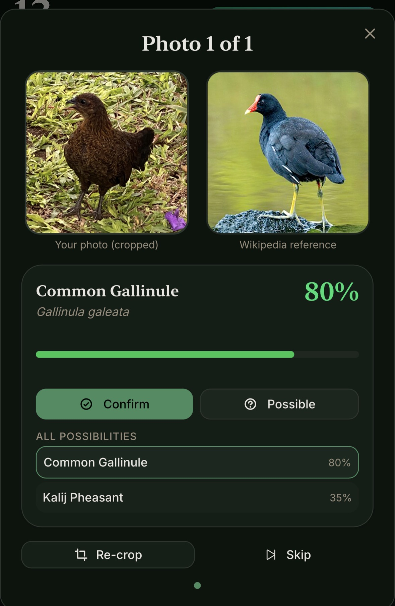
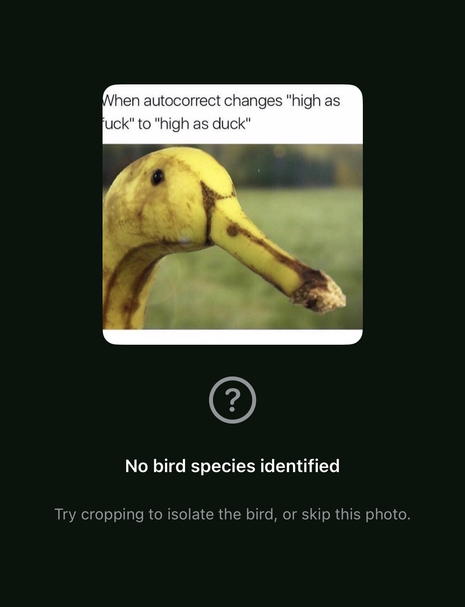
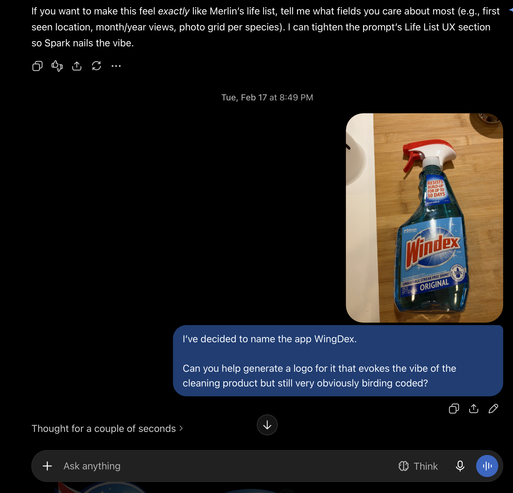
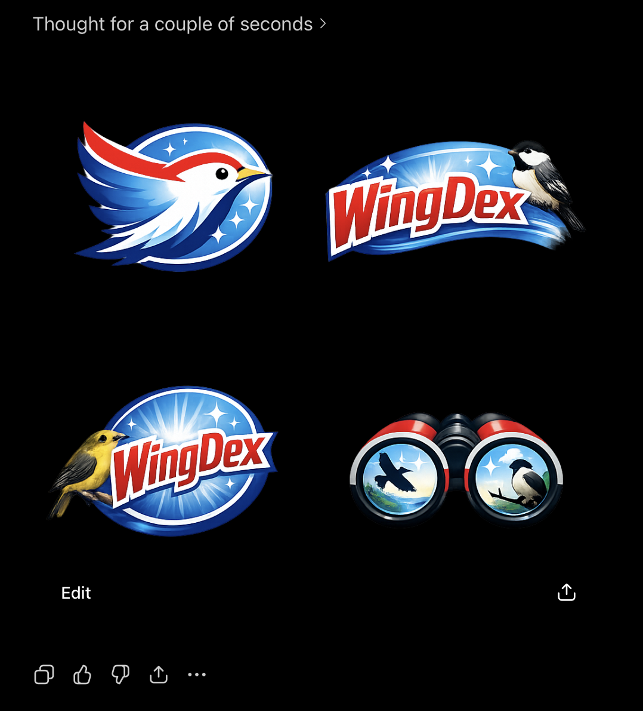
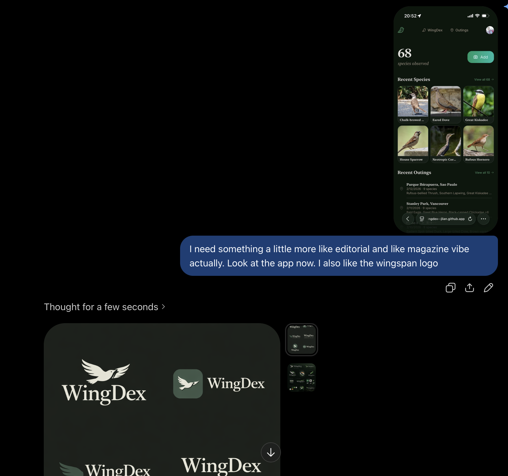

<!-- TODO(John): BEFORE PUBLISHING. config.toml sets goldmark unsafe = true, so every HTML comment in this file ships in the page source. Remove every "TODO(" comment (`grep -n 'TODO(' content/posts/wingdex/index.md` should print nothing), then set draft: false. -->

<!-- TODO(John): [P1] hero photo. Leading candidate: the January sunbird (also photo X if it qualifies; see the outline's photo X criteria). Which species, and where? -->

By January 19 I had a folder of about 100 bird photos from a trip through Taiwan, China and Japan. They were culled, shot on my a6700 with [the bird button](/posts/tracking-expand-spot-bird-button/), and I didn't know what most of them were.

<!-- TODO(John): confirm what Jan 19 is (the day you got home? the day you finished culling?). -->

The obvious tool is [Merlin](https://merlin.allaboutbirds.org/). Identifying one photo, an Osprey from Oaks Bottom, went like this: open Photo ID, pick the photo, crop to the bird, confirm where and when it was taken, look through the suggestions, tap the one that matches, save it. At the end Merlin offers **ID another bird**, which takes you back to picking and cropping.

<!-- TODO(John): [P2] Merlin screenshot strip of the Oaks Bottom Osprey loop. Check the step wording above against the real screens; the outline counts 16 steps. -->

That's 16 steps. I had 100 photos, so 1,600 taps.

<!-- TODO(John): [D1] diagram: the 16-step loop x100 (1,600 taps) next to "select all -> review -> save". -->

For scale: my whole life list is 170 species, from a bit over 400 photos. All of them have since been through WingDex. The biggest batch I've actually imported at once was about 50. The tests run hundreds.

Merlin is excellent at what it's for.[^merlin] So is [Seek](https://www.inaturalist.org/pages/seek_app), which will name nearly anything you point a phone at, and so is [eBird](https://ebird.org/), the record the rest of birding runs on. All three work one bird at a time, ideally while the bird is still there.

[^merlin]: Especially Sound ID. Merlin is built for the moment you're looking at (or listening to) a bird. My problem started weeks after the bird had left.

I asked ChatGPT how people deal with a folder like this. It suggested I start eBird checklists while I'm shooting.

<!-- TODO(John): [P3] screenshot of ChatGPT's answer. -->

I gave up.

The October before, I was at Montrose Point in Chicago at sunrise, the literal sunrise, when a guy with a big lens asked if I'd seen anything cool.

"I just take the pictures and figure it out later," I said, "so I have no idea what I've seen."

"Me too," he said. "It's called reverse birding."

I assumed that was a term. Today the top Google result for it is the WingDex repo.

<!-- TODO(John): [P0] screenshot the "reverse birding" Google results before they change. -->

<!-- TODO(John): source for "more than 150" (App Store search? which date?). -->

There are more than 150 bird identifier apps. I looked for one that would take the whole folder.

Three weeks later, a coworker mentioned [GitHub Spark](https://github.com/features/spark).

## Vibe-code an app

Spark builds an app from a prompt and commits each prompt as the commit message, so the [WingDex](https://github.com/jlian/wingdex) history starts with me talking. The first real commit, on February 12:

> Build a mobile-first web app called "Bird-Dex" that is its own bird life-list + sighting tracker, and is compatible with eBird (import/export) and Merlin (Merlin-like life list UX + optional eBird bridge).

It goes on for a while. About an hour later:

<!-- TODO(John): [P4] optional: swap this block for a screenshot of the four commits on GitHub. -->

```text
26215614 Generated by Spark: Ok still no cropping and still no bird ID
ddab6d46 Generated by Spark: Why is there still no crop? Are we doing AI crop? I was thinking user crop. Maybe it could be AI crop first and then user confirm?
250f8924 Generated by Spark: I'm still not seeing a crop box or any indication of AI crop
e1326575 Generated by Spark: Nope, all the same issues I just mentioned none are fixed, no crop, no outing location detection, and no bird ID
```

Within a day it did the thing. I selected a pile of photos, and it rebuilt my outings from each photo's EXIF time and place: anything within eight hours of each other became one outing, and I reviewed the birds.

<!-- TODO(John): busiest commit day. As recorded (mixed time zones), Feb 13 has 87 commits; in Pacific time it's Feb 12 with 83. Pick one for a line here, or cut it. The old "84 on Feb 15" came from committer dates and is wrong. -->

Spark proved the workflow. After that, anything that shipped had to get past a test or a measurement first.[^upload-button]

[^upload-button]: Except the upload button, which went through twelve commits in 31 minutes on February 15: "premium upload button with gradient, layered shadow, hover lift", "premium circular upload button with gradient and shadow", "refined rectangular upload button with subtle gradient", "inline text upload button, left-aligned with content", "square upload button with icon above text, right-aligned", "minimal hero — species count + Add button", "emerald-to-teal horizontal gradient on Add button" and finally "slightly larger Add button (px-6 py-3, text-base)". Three hours later: "less rounded Add button". <!-- TODO(John): the outline says 15 commits; I count 12 in 31 minutes (02730a2f..15cd38cc), 13 with 53802f05. -->

## Ask GPT, then map the world

The first real version sent every photo to GPT: gpt-4.1-mini at first, later gpt-5.4-mini, with a quick pass and then a stronger second look when the first one wasn't sure. The prompt included where and when the photo was taken. Each photo took a couple of seconds, sometimes 13. I sized the progress bar for 10.

GPT also gave me things I didn't think about at the time, because they came free: a crop box around the bird, a clear "there's no bird here", separate answers when there were several birds, and a note on the plumage.

<!-- TODO(John): [D2] architecture frame 1: photo -> server -> GPT, with the range blobs in R2. -->

By then my wife had become the QA department. Her first dozen issues, over two evenings in February, were about passkeys, time zone ordering and avatar centering. On March 4 she filed #216:

**Isn't this just a chicken?**[^junglefowl]



[^junglefowl]: Technically a chicken is a Red Junglefowl, and that's a species WingDex can answer with. eBird also has "Red Junglefowl (Domestic type)", which WingDex only knows how to display.

Then #238:

**High as duck**

<!-- TODO(John): the meme's caption includes the uncensored word. Fine as-is, crop the caption, or blur? Also: ask your wife before featuring her screenshots. -->



The next reasonable step was a range map of every bird on Earth. On March 20 I rasterized [BirdLife International's](https://datazone.birdlife.org/) range maps onto a 27 km grid: 10,144 species across 681,023 cells, stored as 681K little blobs in R2.[^tailwind] Every candidate GPT suggested got a multiplier for where the photo was taken: 1.0 if the bird lives there, 0.85 if it's near its range, 0.5 if it's out of range.

<!-- TODO(John): the outline puts the "dominance gate" (ignore geography when the photo looks certain) here, but I can't find it in the March code. The term shows up in ml/README (E2) for the on-device era, so I've left it for 8.2. Confirm. -->

[^tailwind]: For a while, local dev kept 360k+ of those blobs as loose files inside the project folder. Tailwind v4 scans the project for class names, so it read every one of them. Loading `/` locally took 28 seconds.

It worked. Sometimes it fixed a wrong ID. It could also punish a right one, which I'd find out in April.

## Cloudflare

Spark was a good place to find out whether any of this worked. On February 22 WingDex moved to [Cloudflare](https://developers.cloudflare.com/workers/) Pages with a [D1](https://developers.cloudflare.com/d1/) database, and on April 18 to Workers, mostly for the logs.[^preview] A SwiftUI iPhone app followed on TestFlight.[^ios-100]

The choice of Cloudflare had some backstory. My [last post that did well on Hacker News](/posts/hdmi-cec/) pushed this site's old host into paid usage, and a month later this site moved to Cloudflare too.

<!-- TODO(John): confirm the old host was Netlify and that the HN spike is why you moved (this repo: CF Pages migration Dec 16, 2025; Netlify config removed Dec 21). Name the host or keep it vague. -->

The rule I came away with: **a surprise audience shouldn't become a surprise bill.** Cloudflare's free tier covers a lot, as long as you design to stay inside it.

Paying OpenAI for every photo anyone uploaded broke that rule. I didn't have a better option yet.

[^preview]: Pages gave every pull request its own preview URL for free. Workers didn't, so after the move every PR deployed to the same preview and the last one won. Nothing complained. It took three months to notice, and the fix was one flag, `--preview-alias`.

[^ios-100]: On March 10 the release bot decided the very first iOS build was 1.0.0 and published it. I reverted it 13 minutes later. <!-- TODO(John): the outline says the release notes were the whole project history. The GitHub release is gone, so I couldn't verify; confirm or cut. --> The real 1.0.0 comes up again later.

## The name, and a scam

The app had already been renamed twice. The first Spark prompt called it "Bird-Dex", and by that evening it was "BirdDex". On February 16 at about 10:30 PM I opened #104, **Maybe need a new name**:

> Too many "birddex" and variants out there. Need something more creative.

It has a table of names already taken (Birdex, FeatherDex, Lifer!, Birda and seven more) and five categories of candidates.[^names] I picked WingDex. I honestly thought it was genius. The rename landed the next morning, and that evening at 8:49 PM I sent ChatGPT this:

<!-- TODO(John): the outline mentions "the pic you're sending (the moment of naming?)". Is it the bottle photo below, or something else? -->



It delivered.



Three minutes later:



The Windex vibe lasted three minutes.[^wingspan][^demo] The icon today is a green bird, and nothing about it says glass cleaner. The name is the only fossil.[^sc-johnson]

[^names]: Rejected: Wingsnap, Shutterbird, LensLark, Aperch.

[^wingspan]: The board game [*Wingspan*](https://stonemaiergames.com/games/wingspan/). I have bought exactly three board games in my life: *Pandemic Legacy*, *Concordia* and *Wingspan*. I bought *Wingspan* before I ever took a bird photo.

[^demo]: The app in that screenshot is showing demo data, 68 species synthesized from a sanitized eBird CSV, with outings at Stanley Park and Parque Ibirapuera in São Paulo. I have not been to São Paulo.

[^sc-johnson]: SC Johnson has not been in touch.

On February 22 at 7:11 PM, the QA department filed #167:

**WingDex is also a butterfly identifier app 🧐**

It was. I had named the app after a cleaning product specifically to be original, and it collided anyway.

<!-- TODO(John): the outline says the butterfly app is "since gone". Worth a link or a date? -->

I filed a trademark application that night. The web app already existed, so that class was "in use". The iPhone app did not, so that class was "intent to use",[^itu] which is a legal promise to the US government that I will ship an iPhone app.

<!-- TODO(John): confirm the filing date (Feb 22, the same night as #167?) and redact the application details from any screenshot. -->

The next morning someone called about my application. By the end of the call I had paid $575, on a virtual card, to something called "The Cadet". I got $500 of it back.[^scam]

<!-- TODO(John): add one or two plain sentences on what the caller said, and how you got the $500 back (chargeback? refund?). Keep it a warning, not a joke. -->

[^itu]: In the US you can file for a trademark before you use it, as long as you swear you intend to. Once the application is allowed, you have six months to file a Statement of Use proving you've actually started, extendable to three years, or the application dies. The USPTO explains it [here](https://www.uspto.gov/trademarks/apply/intent-use-itu-applications).

[^scam]: Trademark filings are public, and they get scraped within hours. If you file, use a lawyer's address or a forwarding address, and read the USPTO's [warning about misleading notices](https://www.uspto.gov/trademarks/protect/caution-misleading-notices) before you answer the phone.

<!-- TODO: sections 5-13 (heron, USPTO letter, training, ranking, fitting, dogs/owls, reverse geocoder, ship, dozens of us) pending John's review of sections 0-4. -->
